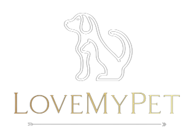

= Documentation de l'application LoveMyPet
:doctype: book
:icons: font
:source-highlighter: coderay
:toc: left
:toc-title: Table des matières

== Partie 1 : Synthèse 

=== titre du projet 

Le titre qu'on a choisi pour notre projet est **LoveMyPet**.

=== Abréviation 

L'abréviation  qu'on a choisi pour notre projet est **LMP**.

=== Logo 
Pour le logo du projet, on a crée le logo suivant :

==== Membres de l'équipe

Le projet LoveMyPet a été réalisé par les membres suivants : 

    Imane Errahmani
    
    Adenle Sadikou

    Malek Messaoudi

=== Présentation

==== Contexte 

Les animaux de compagnie apportent la joie et le soutien émotionnel, cependant, leur adoption peut être un processus très complexe et parfois décourageant, tant pour les futurs adoptants que pour les animaux en attente de foyer. Faciliter l’adoption d’animaux de compagnie n’est pas seulement une question de confort, c’est une opportunité pour sauver des vies et créer des connexions durables entre les animaux et leurs propriétaires.

==== Problématique 

Le processus d'adoption des animaux de compagnie présente actuellement des défis significatifs tant pour les donneurs que pour les adoptants. Les principales problématiques identifiées sont les suivantes :

**Complexité du Processus**: Les plateformes existantes se concentrent principalement sur la mise en relation avec des refuges ou des associations, rendant le processus d'adoption complexe et bureaucratique.

**Suivi du Bien-Être des Animaux**: Après l'adoption, il existe un manque de mécanismes efficaces pour assurer le suivi du bien-être des animaux, ce qui peut entraîner une négligence involontaire.

**Manque de Flexibilité**: Les plateformes actuelles ne permettent pas aux donneurs de spécifier la durée de disponibilité de l'animal, limitant ainsi les options d'adoption temporaire.

==== Gain attendu 

En abordant ces problématiques, notre projet, LoveMyPet, vise à apporter les améliorations suivantes :

**Simplification du Processus d'Adoption**: Offrir une plateforme conviviale où les donneurs peuvent directement mettre en contact des personnes désireuses d'adopter, simplifiant ainsi le processus.

**Suivi Continu du Bien-Être**: Introduire un système de suivi du bien-être des animaux, incluant des rappels pour les vaccinations et d'autres aspects cruciaux, pour garantir une vie épanouissante après l'adoption.

**Flexibilité dans l'Adoption**: Permettre aux donneurs de spécifier la durée de disponibilité de l'animal, offrant ainsi des options d'adoption temporaire et permanente, selon les préférences des utilisateurs.

==== Motivation de l'équipe par rapport au sujet

La motivation principale de notre projet est la volonté de simplifier le processus de l’adoption des animaux de compagnie et d'améliorer leur bien-être.
On vise à créer une plateforme dont l’objectif est de connecter les adoptants potentiels avec les gens qui souhaitent donner leur animal de compagnie soit pour une durée définie (vacances) ou pour toujours.

Notre projet vise aussi à éduquer les futurs propriétaires sur les meilleures pratiques de soins afin de créer une communauté engagée et responsable pour contribuer à une adoption plus répandue et à des vies animales plus épanouies. 

==== Concurrence

Afin de faire une étude de la concurrence, on s’est posé les questions suivantes : 

Qui sont nos concurrents ?
Où sont-ils ?
Que proposent-ils ?
Quelles sont leurs forces et leurs faiblesses ?

Après une recherche sur internet, on a vu qu' en France, il existe beaucoup de sites web permettant l’adoption des animaux que ce soit des sites des fondations (Fondation 30 Millions d’amis, Fondation Brigitte Bardot…)  ou des plateformes d’adoption comme Seconde Chance, La-Spa.fr, PAAW…

On a constaté que sur ces sites web, le service proposé est de mettre en contact un futur adoptant avec une association de la protection des animaux ou avec un refuge, cela est totalement différent du service proposé par notre projet qui est de mettre en contact deux personnes, une qui souhaite donner son animal de compagnie soit de façon définitive ou pour une durée précise (vacance) et l’autre qui représente un futur propriétaire de cet animal.

En revanche ce service peut être existant dans des sites comme LeBonCoin, sauf que dans ce cas, ce site n’est pas dédié seulement aux animaux et leur adoption ce qui n’est pas pratique pour les utilisateurs souhaitant profiter d’un processus d’adoption simple et efficace. 

Ce qui diffère notre projet des concurrents cités, c’est le fait que c’est un site qui permet un suivi du bien être des animaux, cela inclut :
Trouver un propriétaire pour l’animal,
Assurer que le propriétaire prend soin de l’animal en lui envoyant des rappels pour nourrir l’animal, le laver, le vacciner…

Donc au final, notre projet est une combinaison de fonctionnalités permettant une meilleure expérience utilisateur.

==== Personas 

**Donneur d'Animal - Sophie**:

image::sophie.jpg[persona 1]

    Contexte: Sophie, 35 ans, a un chien nommé Max qu'elle aime profondément. Cependant, en raison de changements de vie, elle doit trouver un nouveau foyer pour Max.
    Fonctionnalités Clés:
        Enregistrement facile des informations de Max sur la plateforme.
        Possibilité de donner Max pour une durée à spécifier (temporaire ou permanente).

**Futur Adoptant - Antoine**:

image::antoine.jpg[persona 2]

    Contexte: Antoine, 28 ans, cherche un compagnon animal. Il aimerait adopter un chien pour lui tenir compagnie.
    Fonctionnalités Clés:
        Recherche simplifiée d'animaux disponibles à l'adoption.
        Faire une candidature  pour exprimer son intérêt à adopter.
        Accès à des informations complètes sur les vaccinations et le suivi du bien-être de l'animal.

==== Prévisions Marketing

**Réseaux Sociaux**:

Stratégie: Campagnes engageantes sur des plateformes populaires telles que Facebook, Instagram et Twitter.
Contenu: Témoignages d'adoptions réussies, conseils de soins, et mises en avant des fonctionnalités uniques de LoveMyPet.
Impact Attendu: Augmentation de la notoriété de la plateforme, engagement de la communauté, partages sociaux.

**Site Web**:

Stratégie: Développement d'un site web attrayant et convivial.
Contenu: Histoires inspirantes, guides de soins, témoignages d'utilisateurs, et accès facile aux fonctionnalités de la plateforme.
Impact Attendu: Plateforme centrale pour les informations sur LoveMyPet, conversion des visiteurs en utilisateurs actifs.

**Campagnes d'Influenceurs**:

Stratégie: Partenariat avec des influenceurs dans le domaine des animaux et de l'adoption responsable.
Contenu: Contenu authentique mettant en avant l'utilité de LoveMyPet.
Impact Attendu: Atteinte d'un public plus large, renforcement de la confiance grâce à des recommandations d'influenceurs.

== Partie 2 : Aspects techniques

=== type d'application

LoveMyPet est une application **web**

=== Schéma architectural de l'application

Voici notre schéma architectural 

[plantuml]
----
@startuml

!define RECTANGLE class
!define INTERFACE interface
!define END end

RECTANGLE Frontend {
  PageAccueil
  PagesProfil
  PagesAdoption
  PopUpsInteractifs
  PagesSuiviDeVaccination
  ...
}

RECTANGLE Backend {
  API_REST
  GestionUtilisateurs
  LogiqueAdoption
  SuiviVaccination
}

RECTANGLE BaseDeDonnees {
  TablesPerson
  TablesAnimal
  TablesAdoption
  TablesVaccination
  TablesVaccin
}

Backend -- BaseDeDonnees : communique
Frontend -- Backend : communique

@enduml
----

et voici toutes les API utilisées dans notre projet : 

===== AdoptionController

Point de départ de l'API : `/adoption`

* `GET /adoptions` : Obtenir la liste de toutes les URL d'adoption.
* `GET /{idAdoption}` : Obtenir les détails d'une adoption spécifique par ID.

===== AnimalController

Point de départ de l'API : `/animal`

* `POST /add` : Ajouter un nouvel animal avec un fichier image.
* `GET /person/{idPerson}` : Obtenir la liste des références d'animaux par ID de personne.
* `GET /{id}` : Obtenir les détails d'un animal spécifique par ID.
* `GET /{animalId}/candidatures` : Obtenir la liste des candidatures pour un animal spécifique.
* `POST /addadoption` : Ajouter une nouvelle adoption.

===== CandidatureController

Point de départ de l'API : `/animal/{animalId}/candidature`

* `GET /{candidatureId}` : Obtenir les détails d'une candidature spécifique pour un animal.

===== MesCandidatureController

Point de départ de l'API : `/mescandidature`

* `GET /person/{idPerson}` : Obtenir la liste des références de candidatures par ID de personne.
* `GET /{idCandidature}` : Obtenir les détails d'une candidature spécifique par ID.

===== PersonController

Point de départ de l'API : `/person`

* `GET /{id}` : Obtenir les détails d'une personne spécifique par ID.
* `POST /add` : Ajouter une nouvelle personne avec un fichier image.
* `POST /login` : Authentifier une personne à l'aide de l'e-mail et du mot de passe.
* `GET /profile` : Obtenir les informations du profil utilisateur.
* `POST /addcandidature` : Ajouter une nouvelle candidature.

===== VaccinationController

Point de départ de l'API : `/vaccination`

* `GET /animal/{idAnimal}` : Obtenir les références de vaccination par ID d'animal.
* `GET /{idVaccination}` : Obtenir les détails d'une vaccination spécifique par ID.
* `POST /add` : Ajouter une nouvelle vaccination.

===== VaccinController

Point de départ de l'API : `/vaccin`

* `GET /all` : Obtenir toutes les vaccinations.

==== plateforme technologique

**Langages utilisés**

**Backend (Java)**: Utilisation de Java pour la logique métier, la gestion de la base de données, et la création de l'API REST.

**Frontend (JavaScript, HTML, JSON)**: Utilisation de JavaScript pour la logique côté client, HTML pour la structure des pages, et JSON pour le format des données échangées.

**API REST**

Utilisation d'une architecture RESTful pour la communication entre le frontend et le backend.

**Frameworks de Test**

**Jacoco**: Utilisation de Jacoco pour la mesure de la couverture de code, permettant d'évaluer l'étendue des tests effectués sur le code source Java.

**Gestion de Versions**

**Git**: Utilisation du système de gestion de versions Git pour le suivi des modifications, la collaboration entre les membres de l'équipe, et la gestion des branches de développement.

**Build**

**Maven**: Utilisation de Maven pour la gestion des dépendances, la compilation du code source, et la création d'artefacts binaires.

**Intégration Continue (CI)**

**GitAction**: Mise en place d'un système d'intégration continue pour automatiser les tests, la compilation, et la vérification de la qualité du code à chaque modification dans le référentiel Git.

= Documentation Complète de l'Application

== Partie 1 : Modélisation

=== Fonctionnalité d'Adoption des Animaux

Une fonctionnalité essentielle de notre application est l'adoption d'animaux, offrant une expérience conviviale pour faciliter le processus.

==== Ajout d'Animaux dans "Mes Animaux"

Après avoir ajouté des compagnons dans la section "Mes Animaux", chaque animal est associé au bouton unique "Donner". Cela déclenche un pop-up interactif pour faciliter l'adoption.

**étape 1**
image::enregistrement.png[etape 1]

**étape 2**
image::donner.png[etape 2]

**étape 3**
image::popup.png[etape 3]

==== Configuration des Dates pour l'Adoption

Dans le pop-up, la date de début est obligatoire, indiquant quand l'animal sera disponible pour adoption. La date de fin est facultative, laissant aux donateurs le choix de l'adoption permanente ou temporaire, idéal pour les périodes comme les vacances.

==== Affichage dans la Section "Adoption"

Une fois configuré, l'animal est répertorié dans la section dédiée à l'adoption, avec un bouton "Candidater" pour exprimer l'intérêt.

**étape 4**
image::adoption.png[etape 4]

Cette approche flexible simplifie l'adoption, laissant aux propriétaires le choix de la durée d'adoption.

=== Fonctionnalité de Suivi des Vaccins - Carnet de Vaccination en Ligne

La fonction de suivi des vaccins offre une gestion centralisée des vaccinations des animaux. Accessible depuis "Mes Animaux", elle permet aux propriétaires de maintenir un carnet de vaccination en ligne.

==== Accès Simple

**étape 1**
image::suivi_vaccins.png[etape 1]

**étape 2**
image::mes_animaux.png[etape 2]

==== Vue d'Ensemble des Vaccinations

L'interface propose une vue d'ensemble détaillée des vaccinations, incluant le nom et la date de chaque vaccin.

==== Ajout de Vaccinations

Les propriétaires peuvent ajouter de nouvelles vaccinations à tout moment, garantissant un historique complet et à jour.

= Documentation de la Fonctionnalité de Recherche

== Recherche des Vétérinaires et Jardins à Proximité

L'application offre une fonctionnalité puissante permettant aux utilisateurs de localiser rapidement des vétérinaires ou des jardins à proximité de leur emplacement actuel. Cette fonctionnalité est accessible depuis la page "Mes Services".

=== Utilisation de la Carte depuis la Page "Mes Services"

1. **Accès à la Page "Mes Services"**

Connectez-vous à votre compte sur le site et accédez à la page "Mes Services".

2. **Option "Trouver un Service"**

Recherchez l'option "EXPLORATION FACILE" sur la page "Mes Services" et cliquez dessus.

image::service.jpeg[service]

3. **Choix entre Vétérinaires et Jardins**

Une fois sur la page "EXPLORATION FACILE", les utilisateurs ont deux choix :
- "Trouver un Vétérinaire"
- "Rechercher un Jardin pour se Balader"

Les utilisateurs peuvent sélectionner l'option qui correspond à leur recherche.

image::map.png[Map]

=== Requête vers l'API Overpass

- **Trouver un Vétérinaire :**

Lorsque l'utilisateur choisit "Trouver un Vétérinaire", l'application utilise l'API Overpass pour rechercher les vétérinaires à proximité de la position actuelle de l'utilisateur. La requête à l'API Overpass est générée dynamiquement pour récupérer les nœuds correspondant à la catégorie "amenity=veterinary" dans un rayon défini autour de la position de l'utilisateur.

- **Rechercher un Jardin pour se Balader :**

Si l'utilisateur opte pour "Rechercher un Jardin pour se Balader", l'application effectue une requête pour trouver les nœuds correspondant à la catégorie "leisure=garden" autour de la position actuelle de l'utilisateur. Cette requête est également générée dynamiquement pour récupérer les informations nécessaires.

=== Affichage des Résultats sur la Carte

- **Trouver un Vétérinaire :**

Les résultats de la requête pour les vétérinaires sont affichés sur la carte sous forme de marqueurs. Chaque marqueur représente l'emplacement d'un vétérinaire trouvé.

image::veterinaire.png[veterinaire]

[plantuml]
----
   @startuml
   class CarteVeterinaires {
     + afficherMarqueursVetos(data: String): void
   }

   CarteVeterinaires --|> Leaflet.js
@enduml
----

- **Rechercher un Jardin pour se Balader :**

Pour la recherche de jardins, les résultats correspondants aux nœuds "leisure=garden" sont affichés sur la carte.

image::Parc.png[Parc]

[plantuml]
----
   @startuml
   class CarteJardins {
     + afficherMarqueursJardins(data: String): void
   }

   CarteJardins --|> Leaflet.js
@enduml
----

== Conclusion

En suivant ces étapes simples, les utilisateurs peuvent exploiter la puissance de la carte interactive pour localiser rapidement des vétérinaires ou des jardins à proximité, améliorant ainsi leur expérience utilisateur.

[plantuml]

== Partie 3 : Modélisation 

[plantuml]
----
@startuml

package com.nanterre.LoveMyPet.controller {
  class AdoptionController {
    + getAllAdoptionUrls(): List<String>
    + getAdoptionDetails(idAdoption: Integer): Map<String, Object>
    + addAdoption(adoption: Adoption): ResponseEntity<Map<String, String>>
  }
  class AnimalController {
    + addAnimal(imageFile: MultipartFile, animal: Animal): ResponseEntity<String>
    + getAnimalsReferenceByPersonId(idPerson: Integer): List<String>
    + getAnimalDetailsById(id: Integer): Animal
    + getCandidaturesByAnimalId(animalId: Integer): List<String>
    + addAdoption(adoption: Adoption): ResponseEntity<Map<String, String>>
  }
  class CandidatureController {
    + getCandidatureDetailsByAnimalIdAndCandidatureId(animalId: Integer, candidatureId: Integer): Candidature
  }
  class Controller {
    + showAdoptionPage(model: Model): String
    + showAnimals(model: Model): String
    + showCandidatureByAnimalId(model: Model): String
    + showVaccinations(model: Model): String
    + showCandidatures(model: Model): String
    + showpage(): String
    + showpageaddAnimal(): String
    + showpagelogin(): String
    + homePage(): String
    + profile(): String
  }
  class MesCandidatureController {
    + getCandidatureReferenceByPersonId(idPerson: Integer): List<String>
    + getCandidatureDetailsById(idCandidature: Integer): Candidature
  }
  class PersonController {
    + getPersonDetailsById(id: Integer): Person
    + add(imageFile: MultipartFile, person: Person): ResponseEntity<String>
    + login(email: String, password: String, session: HttpSession): ResponseEntity<?>
    + userProfile(session: HttpSession): ResponseEntity<?>
    + addCandidature(idPerson: Integer, idAdoption: Integer, dateCandidature: String): ResponseEntity<String>
  }
}

package com.nanterre.LoveMyPet.service {
  interface AdoptionService {
    + getAllAdoptionUrls(): List<String>
    + getAdoptionDetails(idAdoption: Integer): Map<String, Object>
    + saveAdoption(adoption: Adoption)
  }
  interface AnimalService {
    + getAnimalLinksByPersonId(idPerson: Integer): List<String>
    + getAnimalDetailsById(id: Integer): Animal
    + getAdoptionUrlsForAnimals(): List<String>
    + saveAnimal(animal: Animal): Animal
    + findAnimalById(id: Integer): Animal
  }
  interface CandidatureService {
    + getCandidatureLinksByAnimalId(animalId: Integer): List<String>
    + getCandidatureDetailsByAnimalIdAndCandidatureId(animalId: Integer, candidatureId: Integer): Candidature
    + saveCandidature(candidature: Candidature)
  }
  interface MesCandidatureService {
    + getCandidatureLinksByPersonId(idPerson: Integer): List<String>
    + getCandidatureDetailsById(idCandidature: Integer): Candidature
  }
  interface PersonService {
    + getPersonDetailsById(id: Integer): Person
    + savePerson(person: Person): Person
    + findPersonByEmail(email: String): Person
  }
}

package com.nanterre.LoveMyPet.repository {
  interface AdoptionRepository {
    + findAll(): List<Adoption>
    + findById(id: Integer): Optional<Adoption>
    + save(adoption: Adoption): Adoption
  }
  interface AnimalRepository {
    + findByIdPerson(idPerson: Integer): List<Animal>
    + findById(id: Integer): Optional<Animal>
    + save(animal: Animal): Animal
  }
  interface CandidatureRepository {
    + getCandidaturesByAnimalId(animalId: Integer): List<Candidature>
    + findById(id: Integer): Optional<Candidature>
    + save(candidature: Candidature): Candidature
  }
  interface MesCandidatureRepository {
    + findByPersonIdPerson(idPerson: Integer): List<Candidature>
    + findById(id: Integer): Optional<Candidature>
    + save(candidature: Candidature): Candidature
  }
  interface PersonRepository {
    + findById(id: Integer): Optional<Person>
    + save(person: Person): Person
    + findPersonByEmail(email: String): Person
  }
}

Controller --|> AdoptionController
Controller --|> AnimalController
Controller --|> CandidatureController
Controller --|> MesCandidatureController
Controller --|> PersonController

AdoptionController --|> AdoptionService
AdoptionController --|> AnimalService

AnimalController --|> AnimalService
AnimalController --|> AdoptionService
AnimalController --|> CandidatureService

CandidatureController --|> CandidatureService

MesCandidatureController --|> MesCandidatureService

PersonController --|> PersonService
PersonController --|> CandidatureService

AdoptionService --|> AdoptionRepository
AnimalService --|> AnimalRepository
CandidatureService --|> CandidatureRepository
MesCandidatureService --|> MesCandidatureRepository
PersonService --|> PersonRepository

@enduml
----

[plantuml]
----
@startuml

package com.nanterre.LoveMyPet.controller {
  class AnimalController {
    + addAnimal(imageFile: MultipartFile, animal: Animal): ResponseEntity<String>
    + getAnimalsReferenceByPersonId(idPerson: Integer): List<String>
    + getAnimalDetailsById(id: Integer): Animal
    + getCandidaturesByAnimalId(animalId: Integer): List<String>
    + addAdoption(adoption: Adoption): ResponseEntity<Map<String, String>>
  }
  class Controller {
    + showAdoptionPage(model: Model): String
    + showAnimals(model: Model): String
    + showCandidatureByAnimalId(model: Model): String
    + showVaccinations(model: Model): String
    + showCandidatures(model: Model): String
    + showpage(): String
    + showpageaddAnimal(): String
    + showpagelogin(): String
    + homePage(): String
    + profile(): String
  }
  class PersonController {
    + getPersonDetailsById(id: Integer): Person
    + add(imageFile: MultipartFile, person: Person): ResponseEntity<String>
    + login(email: String, password: String, session: HttpSession): ResponseEntity<?>
    + userProfile(session: HttpSession): ResponseEntity<?>
    + addCandidature(idPerson: Integer, idAdoption: Integer, dateCandidature: String): ResponseEntity<String>
  }
  class VaccinationController {
    + getVaccinationReferenceByAnimalId(idAnimal: Integer): List<String>
    + getVaccinationDetailsById(idVaccination: Integer): Vaccination
    + add(vaccination: Vaccination, animalId: Integer): String
  }

  class VaccinController {
    - vaccinService: VaccinService
    + VaccinController(vaccinService: VaccinService)
    + getAllVaccins(): Iterable<Vaccin>
  }
}

package com.nanterre.LoveMyPet.service {
  interface AnimalService {
    + getAnimalLinksByPersonId(idPerson: Integer): List<String>
    + getAnimalDetailsById(id: Integer): Animal
    + getAdoptionUrlsForAnimals(): List<String>
    + saveAnimal(animal: Animal): Animal
    + findAnimalById(id: Integer): Animal
  }
  interface PersonService {
    + getPersonDetailsById(id: Integer): Person
    + savePerson(person: Person): Person
    + findPersonByEmail(email: String): Person
  }
  interface VaccinationService {
    + saveVaccination(vaccination: Vaccination): Vaccination
    + getVaccinationLinksByAnimalId(idAnimal: Integer): List<String>
    + getVaccinationDetailsById(idVaccination: Integer): Vaccination
  }
  
  interface VaccinService {
  + getAllVaccins(): Iterable<Vaccin>
  + getVaccinById(id: Integer): Vaccin
  }

}

package com.nanterre.LoveMyPet.repository {
  interface AnimalRepository {
    + findByIdPerson(idPerson: Integer): List<Animal>
    + findById(id: Integer): Optional<Animal>
    + save(animal: Animal): Animal
  }
  interface PersonRepository {
    + findById(id: Integer): Optional<Person>
    + save(person: Person): Person
    + findPersonByEmail(email: String): Person
  }
  interface VaccinRepository {
    + findAll(): Iterable<Vaccin>
    + findById(id: Integer): Optional<Vaccin>
    + save(vaccin: Vaccin): Vaccin
    + deleteById(id: Integer): void
  }
  interface VaccinationRepository {
    + findAll(): List<Vaccination>
    + findById(id: Integer): Optional<Vaccination>
    + save(vaccination: Vaccination): Vaccination
    + deleteById(id: Integer): void
    + findByAnimalId(animalId: Integer): List<Vaccination>
  }
}

Controller --|> VaccinationController
Controller --|> AnimalController
Controller --|> VaccinController
Controller --|> PersonController

VaccinationController --|> VaccinationService
AnimalController --|> AnimalService
VaccinController --|> VaccinService
PersonController --|> PersonService

AnimalService --|> AnimalRepository
VaccinationService --|> VaccinationRepository
VaccinService --|> VaccinRepository
PersonService --|> PersonRepository

@enduml
----

== Base de données

Le diagramme entité-relation ci-dessous offre une représentation visuelle des relations essentielles. En mettant en lumière les liens entre les différentes entités.

=== Modèle LoveMyPet

[plantuml]
----
@startuml

package "com.nanterre.LoveMyPet.model" {
  class Person {
    +idPerson: Integer
    LastName: String
    FirstName: String
    Email: String
    PhoneNumber: String
    Address: String
    Password: String
    ImageUrl: String
  }

  class Animal {
    +id: Integer
    +idPerson: Integer
    name: String
    category: String
    race: String
    weight: Double
    gender: Integer
    dateOfBirth: Date
    imageUrl: String
  }

  class Adoption {
    +idAdoption: Integer
    startDate: Date
    endDate: Date
    +idAnimal: Integer
  }

  class Candidature {
    +idCandidature: Integer
    dateCandidature: Date
    +person: Person
    +adoption: Adoption
  }

  class Vaccin {
    +idVaccin: Integer
    vaccinName: String
  }

  class Vaccination {
    +idVaccination: Integer
    +vaccin: Vaccin
    +animal: Animal
    date: Date
  }
}

Person   --  Animal : "1,1" Adopte "0,N"
Person -- Candidature : "0,N" Candidate à "1,1"
Animal -- Adoption : "1,1" Est concerné par "1,1"
Candidature -- Adoption : "1,1" Correspond à "0,N"
Vaccin -- Vaccination : "0,N" Est utilisé dans "1,N"
Vaccination -- Animal : "1,1" prend "1,N"

@enduml

----
= Planification des Heures de Repas et Envoi de Mails

Cette fonctionnalité vise à automatiser la gestion des repas pour les animaux en permettant aux utilisateurs de planifier les heures de repas de leurs animaux de compagnie. En plus de la planification, le système envoie des rappels par e-mail aux utilisateurs à l'heure programmée pour garantir que leurs animaux reçoivent leur nourriture à temps.

== 1. Création d'un Planning de Repas

=== 1.1 Endpoint
`POST /api/feeding-schedules`

=== 1.2 Description
Cette API permet aux utilisateurs de créer un planning de repas pour un animal spécifique.

=== 1.3 Paramètres
Un objet `FeedingSchedule` doit être inclus dans le corps de la requête, spécifiant l'animal, la fréquence des repas, et les heures de repas.

=== 1.4 Exemple de Corps de Requête
[source, json]
----
{
  "animal": {"id": 1},
  "feedingFrequency": 2,
  "feedingTimes": [
    {"feedingTime": "08:00"},
    {"feedingTime": "18:00"}
  ]
}
----

=== 1.5 Réponse
Un message indiquant que le planning a été créé avec succès.

== 2. Affichage des Utilisateurs avec un Repas Planifié à l'Heure Actuelle

=== 2.1 Endpoint
`GET /api/feeding-schedules/emails-with-current-time`

=== 2.2 Description
Cette API récupère la liste des utilisateurs ayant un repas planifié à l'heure actuelle.

=== 2.3 Réponse
Une chaîne de caractères indiquant le succès de l'opération ou une liste des e-mails dans la console.

== 3. Récupération des Heures de Repas pour un Animal

=== 3.1 Endpoint
`GET /api/feeding-schedules/animal/{animalId}`

=== 3.2 Description
Récupère la liste des heures de repas pour un animal spécifique.

=== 3.3 Paramètres
L'identifiant de l'animal (`animalId`) doit être fourni dans l'URL.

=== 3.4 Exemple de Réponse
[source, json]
----
[
  "08:00",
  "18:00"
]
----

== 4. Envoi d'E-mails

=== 4.1 Endpoint
`POST /api/feeding-schedules/send`

=== 4.2 Description
Envoie un e-mail à une adresse e-mail fixe à des fins de test.

=== 4.3 Exemple de Corps de Requête
[source, http]
----
POST /api/feeding-schedules/send
----

=== 4.4 Réponse
Un message indiquant que l'e-mail a été envoyé avec succès ou une erreur en cas d'échec.

== 5. Envoi Automatique d'E-mails aux Utilisateurs avec un Repas Planifié

=== 5.1 Méthode
`sendEmailToUsersWithCurrentFeedingTime`

=== 5.2 Description
Utilise une tâche planifiée (`@Scheduled`) pour envoyer automatiquement des rappels par e-mail aux utilisateurs ayant un repas planifié à l'heure actuelle.

=== 5.3 Réponse
Un message indiquant que les e-mails ont été envoyés avec succès ou une erreur en cas d'échec.

== 6. API Utilisées

=== 6.1 FeedingScheduleService

- `createFeedingSchedule`: Crée un nouveau planning de repas.
- `getUsersWithCurrentFeedingTime`: Récupère la liste des utilisateurs avec un repas planifié à l'heure actuelle.
- `getFeedingTimesForAnimal`: Récupère la liste des heures de repas pour un animal spécifique.

=== 6.2 EmailSenderService

- `sendSimpleEmail`: Envoie un e-mail simple.
- `sendHtmlEmail`: Envoie un e-mail au format HTML.

== 7. Diagramme UML de la Fonctionnalité

[plantuml]
----
@startuml
package "com.nanterre.LoveMyPet.repository" {
    class FeedingScheduleRepository {
        // Méthodes du repository FeedingSchedule
    }

    class FeedingTimeRepository {
        // Méthodes du repository FeedingTime
    }
}

package "com.nanterre.LoveMyPet.service" {
    interface FeedingScheduleService {
        +createFeedingSchedule(feedingSchedule: FeedingSchedule): FeedingSchedule
        +getUsersWithCurrentFeedingTime(): List<String>
        +getFeedingTimesForAnimal(animalId: Long): List<LocalTime>
    }

    interface EmailSenderService {
        +sendSimpleEmail(toEmail: String, subject: String, body: String): void
        +sendHtmlEmail(toEmail: String, subject: String, body: String): void
    }

    class FeedingScheduleServiceImpl {
        -feedingScheduleRepository: FeedingScheduleRepository
        +createFeedingSchedule(feedingSchedule: FeedingSchedule): FeedingSchedule
        +getUsersWithCurrentFeedingTime(): List<String>
        +getFeedingTimesForAnimal(animalId: Long): List<LocalTime>
    }

    class EmailSenderService {
        -javaMailSender: JavaMailSender
        -fromEmail: String
        +sendSimpleEmail(toEmail: String, subject: String, body: String): void
        +sendHtmlEmail(toEmail: String, subject: String, body: String): void
    }
}

package "com.nanterre.LoveMyPet.controller" {
    class FeedingScheduleController {
        -feedingScheduleService: FeedingScheduleService
        +createFeedingSchedule(feedingSchedule: FeedingSchedule): ResponseEntity<String>
        +displayUsersWithCurrentFeedingTime(): String
        +getFeedingTimesForAnimal(animalId: Long): ResponseEntity<List<LocalTime>>
        +sendEmail(): String
        +sendEmailToUsersWithCurrentFeedingTime(): String
    }
}

FeedingScheduleRepository -- FeedingScheduleService : "1,1" Utilise "1,N"
FeedingScheduleRepository -- FeedingScheduleServiceImpl : "1,1" Utilise "1,1"
FeedingTimeRepository -- FeedingScheduleService : "1,1" Utilise "0,N"
EmailSenderService -- FeedingScheduleService : "1,1" Utilise "0,N"
FeedingScheduleController -- FeedingScheduleService : "1,1" Utilise "1,1"
@enduml
----

== 8. Gestion des **Alertes** et **Planification des Repas**

Cette section détaille la gestion des **alertes** liées à la **planification des repas** pour les animaux de l'utilisateur.

=== 8.1 **Affichage des Alertes**

Lorsque l'utilisateur clique sur le bouton "Mes **Alertes**", il est dirigé vers la page "Mes **Alertes**" qui affiche toutes les **alertes** associées à la **planification des repas** de ses animaux. Chaque **alerte** présente des informations détaillées telles que l'animal concerné, l'heure prévue du repas, et d'autres détails pertinents.

image::./images_planification_food/img1.png[Capture d'écran de la page "Mes **Alertes**"]

=== 8.2 **Planification des Repas**

Si l'utilisateur n'a pas encore **planifié de repas** pour l'un de ses animaux, il sera redirigé vers un formulaire de **planification** lorsqu'il accède à la page "Mes **Alertes**". Le formulaire initial comprend un champ permettant à l'utilisateur de spécifier le **nombre de repas** par jour pour l'animal sélectionné.

image::./images_planification_food/img3.png[Capture d'écran du formulaire de **planification** initial]

Une fois que l'utilisateur a saisi le **nombre de repas**, le formulaire s'ajuste dynamiquement pour afficher autant de champs que nécessaire pour entrer les **heures prévues des repas**. Chaque champ représente une **heure de repas**.

image::./images_planification_food/img2.png[Capture d'écran des champs d'**heures de repas**]

Après avoir rempli le formulaire, l'utilisateur est redirigé vers la page "Mes **Alertes**" pour voir les **alertes** correspondant aux **heures de repas planifiées**.

=== 8.3 **Visualisation des Alertes Planifiées**

La page "Mes **Alertes**" permet à l'utilisateur de visualiser toutes les **alertes planifiées** associées à ses animaux. Les **alertes** comprennent des détails tels que l'animal concerné, l'heure prévue du repas, et d'autres informations pertinentes.

image::./images_planification_food/img1.png[Capture d'écran des **alertes planifiées**]

=== 8.4 Capture d'écran du Mail Envoyé

L'utilisateur reçoit un exemple de courriel pour les rappels de repas planifiés. Cet exemple illustre le contenu typique du courriel envoyé, confirmant l'heure de planification.

Exemple de courriel envoyé le 18:17 (heure de planification)

image::./images_planification_food/img4.png[Capture d'écran du mail envoyé]
