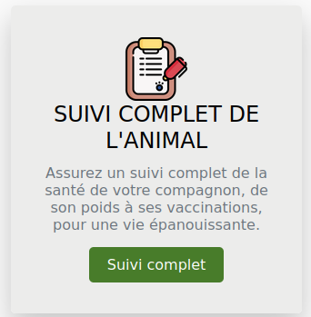
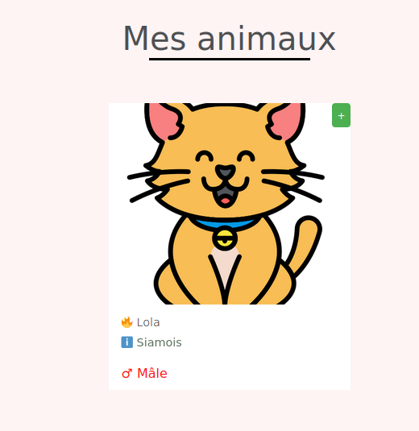
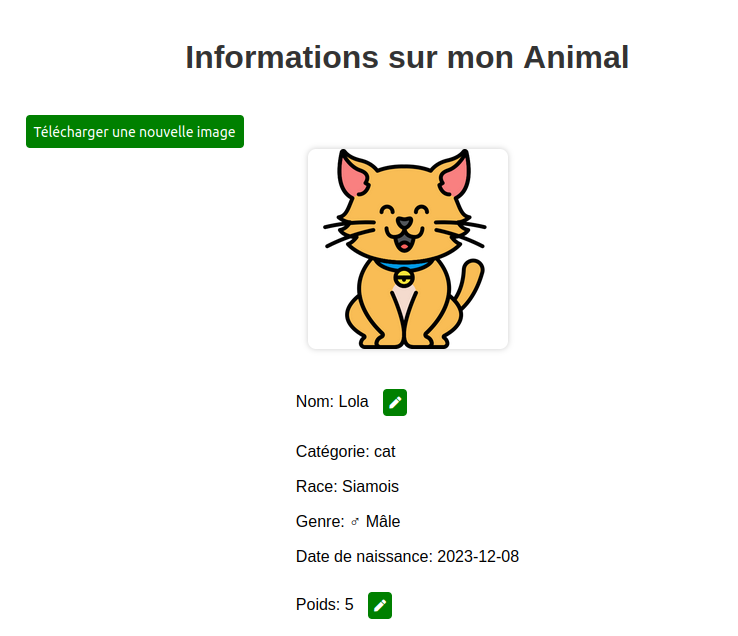
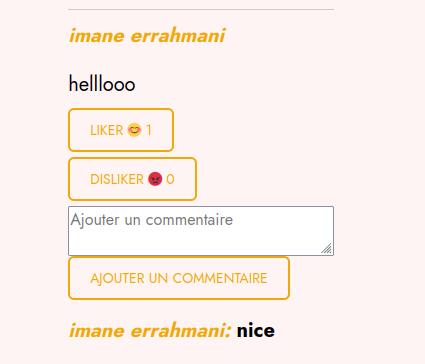
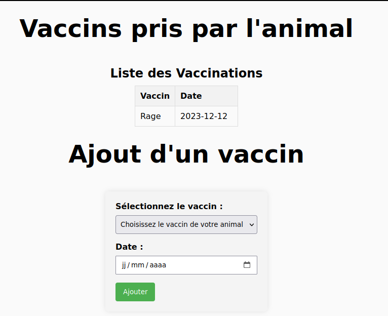

= Documentation de l'application LoveMyPet
:doctype: book
:icons: font
:source-highlighter: coderay
:toc: left
:toc-title: Table des matières

== Partie 1 : Synthèse 

=== titre du projet 

Le titre qu'on a choisi pour notre projet est **LoveMyPet**.

=== Abréviation 

L'abréviation  qu'on a choisi pour notre projet est **LMP**.

=== Logo 
Pour le logo du projet, on a crée le logo suivant :

image::logo.png[logo de lovemypet]

=== Membres de l'équipe

Le projet LoveMyPet a été réalisé par les membres suivants : 

    Imane Errahmani
    
    Adenle Sadikou

    Malek Messaoudi

=== Présentation

==== Contexte 

Les animaux de compagnie apportent la joie et le soutien émotionnel, cependant, leur adoption peut être un processus très complexe et parfois décourageant, tant pour les futurs adoptants que pour les animaux en attente de foyer. Faciliter l’adoption d’animaux de compagnie n’est pas seulement une question de confort, c’est une opportunité pour sauver des vies et créer des connexions durables entre les animaux et leurs propriétaires.

==== Problématique 

Le processus d'adoption des animaux de compagnie présente actuellement des défis significatifs tant pour les donneurs que pour les adoptants. Les principales problématiques identifiées sont les suivantes :

**Complexité du Processus**: Les plateformes existantes se concentrent principalement sur la mise en relation avec des refuges ou des associations, rendant le processus d'adoption complexe et bureaucratique.

**Suivi du Bien-Être des Animaux**: Après l'adoption, il existe un manque de mécanismes efficaces pour assurer le suivi du bien-être des animaux, ce qui peut entraîner une négligence involontaire.

**Manque de Flexibilité**: Les plateformes actuelles ne permettent pas aux donneurs de spécifier la durée de disponibilité de l'animal, limitant ainsi les options d'adoption temporaire.

==== Gain attendu 

En abordant ces problématiques, notre projet, LoveMyPet, vise à apporter les améliorations suivantes :

**Simplification du Processus d'Adoption**: Offrir une plateforme conviviale où les donneurs peuvent directement mettre en contact des personnes désireuses d'adopter, simplifiant ainsi le processus.

**Suivi Continu du Bien-Être**: Introduire un système de suivi du bien-être des animaux, incluant des rappels pour les vaccinations et d'autres aspects cruciaux, pour garantir une vie épanouissante après l'adoption.

**Flexibilité dans l'Adoption**: Permettre aux donneurs de spécifier la durée de disponibilité de l'animal, offrant ainsi des options d'adoption temporaire et permanente, selon les préférences des utilisateurs.

==== Motivation de l'équipe par rapport au sujet

La motivation principale de notre projet est la volonté de simplifier le processus de l’adoption des animaux de compagnie et d'améliorer leur bien-être.
On vise à créer une plateforme dont l’objectif est de connecter les adoptants potentiels avec les gens qui souhaitent donner leur animal de compagnie soit pour une durée définie (vacances) ou pour toujours.

Notre projet vise aussi à éduquer les futurs propriétaires sur les meilleures pratiques de soins afin de créer une communauté engagée et responsable pour contribuer à une adoption plus répandue et à des vies animales plus épanouies. 

==== Concurrence

Afin de faire une étude de la concurrence, on s’est posé les questions suivantes : 

Qui sont nos concurrents ?
Où sont-ils ?
Que proposent-ils ?
Quelles sont leurs forces et leurs faiblesses ?

Après une recherche sur internet, on a vu qu' en France, il existe beaucoup de sites web permettant l’adoption des animaux que ce soit des sites des fondations (Fondation 30 Millions d’amis, Fondation Brigitte Bardot…)  ou des plateformes d’adoption comme Seconde Chance, La-Spa.fr, PAAW…

On a constaté que sur ces sites web, le service proposé est de mettre en contact un futur adoptant avec une association de la protection des animaux ou avec un refuge, cela est totalement différent du service proposé par notre projet qui est de mettre en contact deux personnes, une qui souhaite donner son animal de compagnie soit de façon définitive ou pour une durée précise (vacance) et l’autre qui représente un futur propriétaire de cet animal.

En revanche ce service peut être existant dans des sites comme LeBonCoin, sauf que dans ce cas, ce site n’est pas dédié seulement aux animaux et leur adoption ce qui n’est pas pratique pour les utilisateurs souhaitant profiter d’un processus d’adoption simple et efficace. 

Ce qui diffère notre projet des concurrents cités, c’est le fait que c’est un site qui permet un suivi du bien être des animaux, cela inclut :
Trouver un propriétaire pour l’animal,
Assurer que le propriétaire prend soin de l’animal en lui envoyant des rappels pour nourrir l’animal, le laver, le vacciner…

Donc au final, notre projet est une combinaison de fonctionnalités permettant une meilleure expérience utilisateur.

==== Personas 

**Donneur d'Animal - Sophie**:

image::sophie.jpg[persona 1]

    Contexte: Sophie, 35 ans, a un chien nommé Max qu'elle aime profondément. Cependant, en raison de changements de vie, elle doit trouver un nouveau foyer pour Max.
    Fonctionnalités Clés:
        Enregistrement facile des informations de Max sur la plateforme.
        Possibilité de donner Max pour une durée à spécifier (temporaire ou permanente).

**Futur Adoptant - Antoine**:

image::antoine.jpg[persona 2]

    Contexte: Antoine, 28 ans, cherche un compagnon animal. Il aimerait adopter un chien pour lui tenir compagnie.
    Fonctionnalités Clés:
        Recherche simplifiée d'animaux disponibles à l'adoption.
        Faire une candidature  pour exprimer son intérêt à adopter.
        Accès à des informations complètes sur les vaccinations et le suivi du bien-être de l'animal.

==== Prévisions Marketing

**Réseaux Sociaux**:

Stratégie: Campagnes engageantes sur des plateformes populaires telles que Facebook, Instagram et Twitter.
Contenu: Témoignages d'adoptions réussies, conseils de soins, et mises en avant des fonctionnalités uniques de LoveMyPet.
Impact Attendu: Augmentation de la notoriété de la plateforme, engagement de la communauté, partages sociaux.

**Site Web**:

Stratégie: Développement d'un site web attrayant et convivial.
Contenu: Histoires inspirantes, guides de soins, témoignages d'utilisateurs, et accès facile aux fonctionnalités de la plateforme.
Impact Attendu: Plateforme centrale pour les informations sur LoveMyPet, conversion des visiteurs en utilisateurs actifs.

**Campagnes d'Influenceurs**:

Stratégie: Partenariat avec des influenceurs dans le domaine des animaux et de l'adoption responsable.
Contenu: Contenu authentique mettant en avant l'utilité de LoveMyPet.
Impact Attendu: Atteinte d'un public plus large, renforcement de la confiance grâce à des recommandations d'influenceurs.

== Partie 2 : Aspects techniques

=== type d'application

LoveMyPet est une application **web**

=== Schéma architectural de l'application

Voici notre schéma architectural 

[plantuml]
----
@startuml

!define RECTANGLE class
!define INTERFACE interface
!define END end

RECTANGLE Frontend {
  PageAccueil
  PagesProfil
  PagesAdoption
  PopUpsInteractifs
  PagesSuiviDeVaccination
  ...
}

RECTANGLE Backend {
  API_REST
  GestionUtilisateurs
  LogiqueAdoption
  SuiviVaccination
  LogiqueAlerts
  LogiqueSuiviDuPoids
  LogiqueAffichageDesparcs
  LogiqueAffichageDesVeterinaires
}

RECTANGLE BaseDeDonnees {
  TablesPerson
  TablesAnimal
  TablesAdoption
  TablesVaccination
  TablesVaccin
  TableAdvice
  TableCanidature
  TableComment
  TableFeedingConfirmation
  TableFeedingTime
  TableHistoriqueAdoption
  TableHistoriqueWeight
  TableLikeDislike
  TableLostAnimal
}

Backend -- BaseDeDonnees : communique
Frontend -- Backend : communique

@enduml
----

et voici toutes les API utilisées dans notre projet : 

===== AdoptionController

Point de départ de l'API : `/adoption`

* `GET /adoptions` : Obtenir la liste de toutes les URL d'adoption.
* `GET /{idAdoption}` : Obtenir les détails d'une adoption spécifique par ID.

===== AnimalController

Point de départ de l'API : `/animal`

* `POST /add` : Ajouter un nouvel animal avec un fichier image.
* `GET /person/{idPerson}` : Obtenir la liste des références d'animaux par ID de personne.
* `GET /{id}` : Obtenir les détails d'un animal spécifique par ID.
* `GET /{animalId}/candidatures` : Obtenir la liste des candidatures pour un animal spécifique.
* `POST /addadoption` : Ajouter une nouvelle adoption.

===== CandidatureController

Point de départ de l'API : `/animal/{animalId}/candidature`

* `GET /{candidatureId}` : Obtenir les détails d'une candidature spécifique pour un animal.

===== MesCandidatureController

Point de départ de l'API : `/mescandidature`

* `GET /person/{idPerson}` : Obtenir la liste des références de candidatures par ID de personne.
* `GET /{idCandidature}` : Obtenir les détails d'une candidature spécifique par ID.

===== PersonController

Point de départ de l'API : `/person`

* `GET /{id}` : Obtenir les détails d'une personne spécifique par ID.
* `POST /add` : Ajouter une nouvelle personne avec un fichier image.
* `POST /login` : Authentifier une personne à l'aide de l'e-mail et du mot de passe.
* `GET /profile` : Obtenir les informations du profil utilisateur.
* `POST /addcandidature` : Ajouter une nouvelle candidature.

===== VaccinationController

Point de départ de l'API : `/vaccination`

* `GET /animal/{idAnimal}` : Obtenir les références de vaccination par ID d'animal.
* `GET /{idVaccination}` : Obtenir les détails d'une vaccination spécifique par ID.
* `POST /add` : Ajouter une nouvelle vaccination.

===== VaccinController

Point de départ de l'API : `/vaccin`

* `GET /all` : Obtenir toutes les vaccinations.

===== HistoriqueAdoptionController

Point de départ de l'API : `/historiqueadoption`

* `POST /ajouteradoption` : ajouter une adoption temporaire dans la table.

===== HistoriqueWeightController

Point de départ de l'API : `/historiqueWeight`

* `GET /animal/{idAnimal}` : Récupérer la liste des liens d'historique de poids pour un animal donné.
*`GET /{id}` : Récupérer les détails d'un enregistrement d'historique de poids par son identifiant.
*`GET /data/{idAnimal}` : Récupérer les données d'historique de poids pour un animal donné.

===== InfoAnimalController

Point de départ de l'API : `/infoanimal`

* `GET /{idAnimal}` : Récupérer les informations concernant un animal à partir de son id
*`POST /updateName/{idAnimal}` : modifier le nom de l'animal dont l'identifiant est idAnimal.
*`POST /updateWeight/{idAnimal}` : modifier le poids de l'animal dont l'identifiant est idAnimal.
*`POST /updateImage/{idAnimal}` : modifier l'image de l'animal dont l'identifiant est idAnimal.

===== LostAnimalController

Point de départ de l'API : `/lost-animal`

* `POST /add` : Ajouter un animal perdu dans la table LotAnimal.
*`GET /list` : Récupérer la liste des animaux perdus.

===== MesCandidatureController

Point de départ de l'API : `/mescandidature`

* `GET /person/{idPerson}` : Récupérer les liens des candidatures de la personne.
*`GET /{idCandidature}` : Récupérer la candidature.

==== plateforme technologique

**Langages utilisés**

**Backend (Java)**: Utilisation de Java pour la logique métier, la gestion de la base de données, et la création de l'API REST.

**Frontend (JavaScript, HTML, JSON)**: Utilisation de JavaScript pour la logique côté client, HTML pour la structure des pages, et JSON pour le format des données échangées.

**API REST**

Utilisation d'une architecture RESTful pour la communication entre le frontend et le backend.

**Frameworks de Test**

**Jacoco**: Utilisation de Jacoco pour la mesure de la couverture de code, permettant d'évaluer l'étendue des tests effectués sur le code source Java.

**Gestion de Versions**

**Git**: Utilisation du système de gestion de versions Git pour le suivi des modifications, la collaboration entre les membres de l'équipe, et la gestion des branches de développement.

**Build**

**Maven**: Utilisation de Maven pour la gestion des dépendances, la compilation du code source, et la création d'artefacts binaires.

**Intégration Continue (CI)**

**GitAction**: Mise en place d'un système d'intégration continue pour automatiser les tests, la compilation, et la vérification de la qualité du code à chaque modification dans le référentiel Git.

= Documentation Complète de l'Application

== Partie 1 : Modélisation

=== Petite feature pour l'affichage et la modification des informations des Animaux

Cette feature permet de viualiser et modifer les détails d'un animal sur le site.

==== Maquette du front

Dans notre page des services, il faut cliquer sur SUIVI COMPLET DE L'ANIMAL

Dans la page Mes animaux, il figure un signe (+) pour chaque animal, cliquez dessus pour accéder aux détails de votre animal

Voici une vision des informations de votre animal, modifiables avec les trois boutons verts 

==== Diagramme de classes (partie métier)

Voici un diagramme des classes qui explique la partie métier de cette petite feature 

@startuml
package com.nanterre.LoveMyPet.controller {
    class InfoAnimalController {
        - infoAnimalService: InfoAnimalServiceImpl
        + getCandidatureDetailsById(idAnimal: Integer): Animal
        + updateAnimalName(idAnimal: Integer, requestBody: Map<String, String>): ResponseEntity<String>
        + updateAnimalWeight(idAnimal: Integer, requestBody: Map<String, Double>): ResponseEntity<String>
        + updateAnimalImage(idAnimal: Integer, imageFile: MultipartFile): ResponseEntity<String>
    }
}

package com.nanterre.LoveMyPet.model {
    class Animal {
        - id: Integer
        - idPerson: Integer
        - name: String
        - category: String
        - race: String
        - weight: Double
        - gender: Integer
        - dateOfBirth: Date
        - imageUrl: String
        - adoptedByPerson: Person
    }

    class Person {
        - idperson: Integer
        // Add other attributes if needed
    }

    class HistoriqueWeight {
        // Add attributes for HistoriqueWeight
    }
}

package com.nanterre.LoveMyPet.repository {
    interface InfoAnimalRepository {
        // Methods from JpaRepository
    }
}

package com.nanterre.LoveMyPet.service {
    interface InfoAnimalService {
        + getInfoAnimalDetailsById(idAnimal: Integer): Animal
        + updateAnimalName(idAnimal: Integer, newName: String): void
        + updateAnimalWeight(idAnimal: Integer, newWeight: Double): void
        + updateAnimalImage(idAnimal: Integer, imageUrl: String): void
    }

    class InfoAnimalServiceImpl {
        - entityManager: EntityManager
        - animalInfoRepository: InfoAnimalRepository
        + getInfoAnimalDetailsById(idAnimal: Integer): Animal
        + updateAnimalName(idAnimal: Integer, newName: String): void
        + updateAnimalWeight(idAnimal: Integer, newWeight: Double): void
        + updateAnimalImage(idAnimal: Integer, imageUrl: String): void
    }
}

InfoAnimalController --> InfoAnimalServiceImpl: infoAnimalService
InfoAnimalServiceImpl --> InfoAnimalRepository: animalInfoRepository
InfoAnimalServiceImpl --> EntityManager: entityManager
InfoAnimalServiceImpl --> Animal
InfoAnimalServiceImpl --> HistoriqueWeight

@enduml

==== Description API REST

Point de départ de l'API : `/infoanimal`

* `GET /{idAnimal}` : Récupérer les informations concernant un animal à partir de son id
*`POST /updateName/{idAnimal}` : modifier le nom de l'animal dont l'identifiant est idAnimal.
*`POST /updateWeight/{idAnimal}` : modifier le poids de l'animal dont l'identifiant est idAnimal.
*`POST /updateImage/{idAnimal}` : modifier l'image de l'animal dont l'identifiant est idAnimal.

==== Diagrammes de séquence des interactions front/back

@startuml
actor Utilisateur
participant JavaScript
participant BackEnd
database BaseDeDonnees

Utilisateur -> JavaScript: Clique sur le bouton de modification
JavaScript -> Utilisateur: Affiche une boîte de dialogue pour entrer les nouvelles informations
Utilisateur --> JavaScript: Entrez les nouvelles informations

JavaScript -> BackEnd: Requête POST vers /infoanimal/updateName/{idAnimal} avec le nouveau nom
BackEnd --> JavaScript: Réponse HTTP (succès ou échec)
JavaScript -> BaseDeDonnees: Mise à jour du nom dans la base de données

JavaScript -> BackEnd: Requête POST vers /infoanimal/updateWeight/{idAnimal} avec le nouveau poids
BackEnd --> JavaScript: Réponse HTTP (succès ou échec)
JavaScript -> BaseDeDonnees: Mise à jour du poids dans la base de données

JavaScript -> BackEnd: Requête POST vers /infoanimal/updateImage/{idAnimal} avec le nouveau fichier image
BackEnd --> JavaScript: Réponse HTTP (succès ou échec)
JavaScript -> BaseDeDonnees: Mise à jour de l'URL de l'image dans la base de données

Utilisateur -> JavaScript: Recharge la page pour refléter les modifications
@enduml

=== Petite feature pour commenter les publications Advice dans le forum de LoveMyPet

Cette petite feature permet de rajouter de commenter les publications

==== Maquette du front

Dans notre page Forum Animal, commenter les publications

==== Diagramme de classes (partie métier)

Voici un diagramme des classes qui explique la partie métier de cette petite feature 

@startuml

package com.nanterre.LoveMyPet.controller {
  class AdviceController {
    - adviceService: AdviceService
    + addCommentToAdvice(adviceId: Integer, commentText: String, idPerson: Integer): ResponseEntity<String>
    + getCommentLinksByAdviceId(adviceId: Integer): List<String>
    + getCommentDetailsById(commentId: Integer): ResponseEntity<Comment>
    + getCommentsByAdviceId(adviceId: Integer): ResponseEntity<List<Comment>>
  }
}

package com.nanterre.LoveMyPet.model {
  class Advice {
    - adviceId: Integer
    - comments: List<Comment>
  }
  
  class Comment {
    - commentId: Integer
    - advice: Advice
    - commenter: Person
    - text: String
  }
  
  class Person {
    - idPerson: Integer
  }
}

package com.nanterre.LoveMyPet.repository {
  interface CommentRepository {
    + findById(commentId: Integer): Optional<Comment>
    + save(comment: Comment): Comment
  }

  interface AdviceRepository {
    + findById(adviceId: Integer): Optional<Advice>
    + save(advice: Advice): Advice
  }
}

package com.nanterre.LoveMyPet.service {
  class AdviceServiceImpl {
    - adviceRepository: AdviceRepository
    - commentRepository: CommentRepository
    + addCommentToAdvice(adviceId: Integer, commentText: String, idPerson: Integer): void
    + getCommentLinksByAdviceId(adviceId: Integer): List<String>
    + getCommentDetailsById(commentId: Integer): Comment
    + getCommentsByAdviceId(adviceId: Integer): List<Comment>
  }
}

AdviceController --> AdviceService
AdviceController --> Advice
AdviceController --> Comment
AdviceController --> ResponseEntity
AdviceController --> HttpStatus

Comment --> Advice
Comment --> Person

CommentRepository --> Comment

AdviceServiceImpl --> AdviceRepository
AdviceServiceImpl --> CommentRepository

AdviceRepository --> Advice
AdviceRepository --> JpaRepository

@enduml

==== Description API REST

Point de départ de l'API : `/api/advices`

* `POST /addComment/{adviceId}` : Ajouter un commentaire lié à l'advice adviceId
*`GET /adviceComments/{adviceId}` : Récupérer la liste des liens des commentaires de la publication adviceId.
*`GET /comment/{commentId}` : Récupérer les détails d'un commentaire.

==== Diagrammes de séquence des interactions front/back

@startuml

actor Utilisateur
participant JavaScript
participant BackEnd
database BaseDeDonnees

Utilisateur -> JavaScript: Consulte les conseils
JavaScript -> BackEnd: Requête GET vers /api/advices
BackEnd --> JavaScript: Renvoie la liste des conseils

Utilisateur -> JavaScript: Ajoute un commentaire à un conseil
JavaScript -> BackEnd: Requête POST vers /api/advices/addComment/{adviceId}?idPerson={idPerson} avec le texte du commentaire
BackEnd --> JavaScript: Réponse HTTP (succès ou échec)

Utilisateur -> JavaScript: Consulte les commentaires d'un conseil
JavaScript -> BackEnd: Requête GET vers /api/advices/adviceComments/{adviceId}
BackEnd --> JavaScript: Renvoie la liste des commentaires

Utilisateur -> JavaScript: Consulte les détails d'un commentaire
JavaScript -> BackEnd: Requête GET vers /api/advices/comment/{commentId}
BackEnd --> JavaScript: Renvoie les détails du commentaire

@enduml

=== Fonctionnalité de Suivi des Vaccins - Carnet de Vaccination en Ligne

La fonction de suivi des vaccins offre une gestion centralisée des vaccinations des animaux. Accessible depuis "Mes Animaux", elle permet aux propriétaires de maintenir un carnet de vaccination en ligne.

==== Maquette du front

Cette page permet d'ajouter et de visualiser les vaccinations de votre animal 

==== Diagramme de classes (partie métier)
Voici un diagramme des classes qui explique la partie métier de cette  feature

@startuml

package "com.nanterre.LoveMyPet.controller" {
    class VaccinationController {
        +getVaccinationReferenceByAnimalId(idAnimal: Integer): List<String>
        +getVaccinationDetailsById(idVaccination: Integer): Vaccination
        +add(vaccination: Vaccination, animalId: Integer): String
    }

    class VaccinController {
        -vaccinService: VaccinService
        +getAllVaccins(): Iterable<Vaccin>
    }
}

package "com.nanterre.LoveMyPet.model" {
    class Vaccin {
        -idVaccin: Integer
        -vaccinName: String
        +getIdVaccin(): Integer
        +getVaccinName(): String
    }

    class Vaccination {
        -idVaccination: Integer
        -vaccin: Vaccin
        -animal: Animal
        -date: Date
        +getIdVaccination(): Integer
        +getVaccin(): Vaccin
        +getAnimal(): Animal
        +getDate(): Date
    }

    class Animal {
        -idAnimal: Integer
        // ... (other attributes and methods)
    }
}

package "com.nanterre.LoveMyPet.repository" {
    interface VaccinationRepository {
        +findByAnimalId(animalId: Integer): List<Vaccination>
    }

    interface VaccinRepository {
        +findAll(): Iterable<Vaccin>
    }
}

package "com.nanterre.LoveMyPet.service" {
    interface VaccinationService {
        +saveVaccination(vaccination: Vaccination): Vaccination
        +getVaccinationLinksByAnimalId(idAnimal: Integer): List<String>
        +getVaccinationDetailsById(idVaccination: Integer): Vaccination
    }

    class VaccinationServiceImpl {
        -entityManager: EntityManager
        -vaccinationRepository: VaccinationRepository
        +saveVaccination(vaccination: Vaccination): Vaccination
        +getVaccinationLinksByAnimalId(idAnimal: Integer): List<String>
        +getVaccinationDetailsById(idVaccination: Integer): Vaccination
    }

    interface VaccinService {
        +getAllVaccins(): Iterable<Vaccin>
        +getVaccinById(id: Integer): Vaccin
    }

    class VaccinServiceImpl {
        -vaccinRepository: VaccinRepository
        +getAllVaccins(): Iterable<Vaccin>
        +getVaccinById(id: Integer): Vaccin
    }
}

VaccinationController --> VaccinationServiceImpl
VaccinationServiceImpl --> VaccinationRepository
VaccinController --> VaccinService
VaccinService --> VaccinRepository
VaccinationRepository --> Vaccination
VaccinRepository --> Vaccin

Vaccination --> Vaccin
Vaccination --> Animal

@enduml

==== Description API REST 

VaccinationController

Point de départ de l'API : `/vaccination`

* `GET /animal/{idAnimal}` : Obtenir les références de vaccination par ID d'animal.
* `GET /{idVaccination}` : Obtenir les détails d'une vaccination spécifique par ID.
* `POST /add` : Ajouter une nouvelle vaccination.

VaccinController

Point de départ de l'API : `/vaccin`

* `GET /all` : Obtenir toutes les vaccinations.

==== Diagrammes de séquence des interactions front/back

@startuml

actor Utilisateur as User
participant Frontend as FrontendHTML
participant BackendController as VaccinationController
participant VaccinationService as VaccinationServiceImpl
participant VaccinationRepository as VaccinationRepository
database VaccinationDB as VaccinationDB
database VaccinDB as VaccinDB

activate FrontendHTML

User -> FrontendHTML: Accéder à la page de suivi
activate BackendController
FrontendHTML -> BackendController: Effectuer une requête pour obtenir les données des vaccinations
activate VaccinationService
BackendController -> VaccinationService: Appeler getVaccinationLinksByAnimalId
activate VaccinationRepository
VaccinationService -> VaccinationRepository: Appeler findByAnimalId
VaccinationRepository -> VaccinationDB: Requête pour obtenir les vaccinations
VaccinationDB --> VaccinationRepository: Renvoyer les données
VaccinationRepository --> VaccinationService: Renvoyer les données
deactivate VaccinationDB
deactivate VaccinationRepository
deactivate VaccinationService
BackendController --> FrontendHTML: Renvoyer les données au frontend
deactivate BackendController

User -> FrontendHTML: Ajouter un nouveau vaccin
activate FrontendHTML
FrontendHTML -> BackendController: Envoyer les données du formulaire
activate VaccinationService
BackendController -> VaccinationService: Appeler saveVaccination
activate VaccinationRepository
VaccinationService -> VaccinationRepository: Appeler save
VaccinationRepository -> VaccinationDB: Enregistrer le nouveau vaccin
VaccinationDB --> VaccinationRepository: Confirmation de l'enregistrement
VaccinationRepository --> VaccinationService: Renvoyer la confirmation
deactivate VaccinationDB
deactivate VaccinationRepository
deactivate VaccinationService
BackendController --> FrontendHTML: Renvoyer la confirmation au frontend
deactivate BackendController

@enduml

== Fonctionnalité de Gestion des Animaux Perdus

La section "Animaux Perdus" de LoveMyPet propose une fonctionnalité permettant aux utilisateurs de déclarer et de retrouver leurs compagnons perdus. Lorsque vous accédez à cette section depuis la page "Nos Services", vous trouverez deux boutons distincts : "Déclarer un Animal Perdu" et "Liste des Animaux Perdus".

    Déclarer un Animal Perdu :
    En cliquant sur ce bouton, les utilisateurs peuvent remplir un formulaire pour déclarer un animal perdu. Ils peuvent fournir des détails tels que le nom de l'animal, une description, une photo, et d'autres informations pertinentes.

    Liste des Animaux Perdus :
    Ce bouton affiche une liste des animaux perdus déclarés par la communauté LoveMyPet. Les utilisateurs peuvent parcourir cette liste pour retrouver des animaux perdus et faciliter des réunions chaleureuses entre les amis à fourrure égarés et leurs propriétaires.
L'API Nominatim est utilisée pour convertir le nom de la ville saisi par l'utilisateur en coordonnées géographiques, ce qui permet d'étendre la fonctionnalité de recherche par ville et périmètre.

== Partie 3 : Modélisation

[plantuml]
----
@startuml

package com.nanterre.LoveMyPet.controller {
  class AdoptionController {
    + getAllAdoptionUrls(): List<String>
    + getAdoptionDetails(idAdoption: Integer): Map<String, Object>
    + addAdoption(adoption: Adoption): ResponseEntity<Map<String, String>>
  }
  class AnimalController {
    + addAnimal(imageFile: MultipartFile, animal: Animal): ResponseEntity<String>
    + getAnimalsReferenceByPersonId(idPerson: Integer): List<String>
    + getAnimalDetailsById(id: Integer): Animal
    + getCandidaturesByAnimalId(animalId: Integer): List<String>
    + addAdoption(adoption: Adoption): ResponseEntity<Map<String, String>>
  }
  class CandidatureController {
    + getCandidatureDetailsByAnimalIdAndCandidatureId(animalId: Integer, candidatureId: Integer): Candidature
  }
  class Controller {
    + showAdoptionPage(model: Model): String
    + showAnimals(model: Model): String
    + showCandidatureByAnimalId(model: Model): String
    + showVaccinations(model: Model): String
    + showCandidatures(model: Model): String
    + showpage(): String
    + showpageaddAnimal(): String
    + showpagelogin(): String
    + homePage(): String
    + profile(): String
  }
  class MesCandidatureController {
    + getCandidatureReferenceByPersonId(idPerson: Integer): List<String>
    + getCandidatureDetailsById(idCandidature: Integer): Candidature
  }
  class PersonController {
    + getPersonDetailsById(id: Integer): Person
    + add(imageFile: MultipartFile, person: Person): ResponseEntity<String>
    + login(email: String, password: String, session: HttpSession): ResponseEntity<?>
    + userProfile(session: HttpSession): ResponseEntity<?>
    + addCandidature(idPerson: Integer, idAdoption: Integer, dateCandidature: String): ResponseEntity<String>
  }
}

package com.nanterre.LoveMyPet.service {
  interface AdoptionService {
    + getAllAdoptionUrls(): List<String>
    + getAdoptionDetails(idAdoption: Integer): Map<String, Object>
    + saveAdoption(adoption: Adoption)
  }
  interface AnimalService {
    + getAnimalLinksByPersonId(idPerson: Integer): List<String>
    + getAnimalDetailsById(id: Integer): Animal
    + getAdoptionUrlsForAnimals(): List<String>
    + saveAnimal(animal: Animal): Animal
    + findAnimalById(id: Integer): Animal
  }
  interface CandidatureService {
    + getCandidatureLinksByAnimalId(animalId: Integer): List<String>
    + getCandidatureDetailsByAnimalIdAndCandidatureId(animalId: Integer, candidatureId: Integer): Candidature
    + saveCandidature(candidature: Candidature)
  }
  interface MesCandidatureService {
    + getCandidatureLinksByPersonId(idPerson: Integer): List<String>
    + getCandidatureDetailsById(idCandidature: Integer): Candidature
  }
  interface PersonService {
    + getPersonDetailsById(id: Integer): Person
    + savePerson(person: Person): Person
    + findPersonByEmail(email: String): Person
  }
}

package com.nanterre.LoveMyPet.repository {
  interface AdoptionRepository {
    + findAll(): List<Adoption>
    + findById(id: Integer): Optional<Adoption>
    + save(adoption: Adoption): Adoption
  }
  interface AnimalRepository {
    + findByIdPerson(idPerson: Integer): List<Animal>
    + findById(id: Integer): Optional<Animal>
    + save(animal: Animal): Animal
  }
  interface CandidatureRepository {
    + getCandidaturesByAnimalId(animalId: Integer): List<Candidature>
    + findById(id: Integer): Optional<Candidature>
    + save(candidature: Candidature): Candidature
  }
  interface MesCandidatureRepository {
    + findByPersonIdPerson(idPerson: Integer): List<Candidature>
    + findById(id: Integer): Optional<Candidature>
    + save(candidature: Candidature): Candidature
  }
  interface PersonRepository {
    + findById(id: Integer): Optional<Person>
    + save(person: Person): Person
    + findPersonByEmail(email: String): Person
  }
}

Controller --|> AdoptionController
Controller --|> AnimalController
Controller --|> CandidatureController
Controller --|> MesCandidatureController
Controller --|> PersonController

AdoptionController --|> AdoptionService
AdoptionController --|> AnimalService

AnimalController --|> AnimalService
AnimalController --|> AdoptionService
AnimalController --|> CandidatureService

CandidatureController --|> CandidatureService

MesCandidatureController --|> MesCandidatureService

PersonController --|> PersonService
PersonController --|> CandidatureService

AdoptionService --|> AdoptionRepository
AnimalService --|> AnimalRepository
CandidatureService --|> CandidatureRepository
MesCandidatureService --|> MesCandidatureRepository
PersonService --|> PersonRepository

@enduml
----

[plantuml]
----
@startuml

package com.nanterre.LoveMyPet.controller {
  class AnimalController {
    + addAnimal(imageFile: MultipartFile, animal: Animal): ResponseEntity<String>
    + getAnimalsReferenceByPersonId(idPerson: Integer): List<String>
    + getAnimalDetailsById(id: Integer): Animal
    + getCandidaturesByAnimalId(animalId: Integer): List<String>
    + addAdoption(adoption: Adoption): ResponseEntity<Map<String, String>>
  }
  class Controller {
    + showAdoptionPage(model: Model): String
    + showAnimals(model: Model): String
    + showCandidatureByAnimalId(model: Model): String
    + showVaccinations(model: Model): String
    + showCandidatures(model: Model): String
    + showpage(): String
    + showpageaddAnimal(): String
    + showpagelogin(): String
    + homePage(): String
    + profile(): String
  }
  class PersonController {
    + getPersonDetailsById(id: Integer): Person
    + add(imageFile: MultipartFile, person: Person): ResponseEntity<String>
    + login(email: String, password: String, session: HttpSession): ResponseEntity<?>
    + userProfile(session: HttpSession): ResponseEntity<?>
    + addCandidature(idPerson: Integer, idAdoption: Integer, dateCandidature: String): ResponseEntity<String>
  }
  class VaccinationController {
    + getVaccinationReferenceByAnimalId(idAnimal: Integer): List<String>
    + getVaccinationDetailsById(idVaccination: Integer): Vaccination
    + add(vaccination: Vaccination, animalId: Integer): String
  }

  class VaccinController {
    - vaccinService: VaccinService
    + VaccinController(vaccinService: VaccinService)
    + getAllVaccins(): Iterable<Vaccin>
  }
}

package com.nanterre.LoveMyPet.service {
  interface AnimalService {
    + getAnimalLinksByPersonId(idPerson: Integer): List<String>
    + getAnimalDetailsById(id: Integer): Animal
    + getAdoptionUrlsForAnimals(): List<String>
    + saveAnimal(animal: Animal): Animal
    + findAnimalById(id: Integer): Animal
  }
  interface PersonService {
    + getPersonDetailsById(id: Integer): Person
    + savePerson(person: Person): Person
    + findPersonByEmail(email: String): Person
  }
  interface VaccinationService {
    + saveVaccination(vaccination: Vaccination): Vaccination
    + getVaccinationLinksByAnimalId(idAnimal: Integer): List<String>
    + getVaccinationDetailsById(idVaccination: Integer): Vaccination
  }
  
  interface VaccinService {
  + getAllVaccins(): Iterable<Vaccin>
  + getVaccinById(id: Integer): Vaccin
  }

}

package com.nanterre.LoveMyPet.repository {
  interface AnimalRepository {
    + findByIdPerson(idPerson: Integer): List<Animal>
    + findById(id: Integer): Optional<Animal>
    + save(animal: Animal): Animal
  }
  interface PersonRepository {
    + findById(id: Integer): Optional<Person>
    + save(person: Person): Person
    + findPersonByEmail(email: String): Person
  }
  interface VaccinRepository {
    + findAll(): Iterable<Vaccin>
    + findById(id: Integer): Optional<Vaccin>
    + save(vaccin: Vaccin): Vaccin
    + deleteById(id: Integer): void
  }
  interface VaccinationRepository {
    + findAll(): List<Vaccination>
    + findById(id: Integer): Optional<Vaccination>
    + save(vaccination: Vaccination): Vaccination
    + deleteById(id: Integer): void
    + findByAnimalId(animalId: Integer): List<Vaccination>
  }
}

Controller --|> VaccinationController
Controller --|> AnimalController
Controller --|> VaccinController
Controller --|> PersonController

VaccinationController --|> VaccinationService
AnimalController --|> AnimalService
VaccinController --|> VaccinService
PersonController --|> PersonService

AnimalService --|> AnimalRepository
VaccinationService --|> VaccinationRepository
VaccinService --|> VaccinRepository
PersonService --|> PersonRepository

@enduml
----

== Base de données

Le diagramme entité-relation ci-dessous offre une représentation visuelle des relations essentielles. En mettant en lumière les liens entre les différentes entités.

=== Modèle LoveMyPet

[plantuml]
----
@startuml

package "com.nanterre.LoveMyPet.model" {
  class Person {
    +idPerson: Integer
    LastName: String
    FirstName: String
    Email: String
    PhoneNumber: String
    Address: String
    Password: String
    ImageUrl: String
  }

  class Animal {
    +id: Integer
    +idPerson: Integer
    name: String
    category: String
    race: String
    weight: Double
    gender: Integer
    dateOfBirth: Date
    imageUrl: String
  }

  class Adoption {
    +idAdoption: Integer
    startDate: Date
    endDate: Date
    +idAnimal: Integer
  }

  class Candidature {
    +idCandidature: Integer
    dateCandidature: Date
    +person: Person
    +adoption: Adoption
  }

  class Vaccin {
    +idVaccin: Integer
    vaccinName: String
  }

  class Vaccination {
    +idVaccination: Integer
    +vaccin: Vaccin
    +animal: Animal
    date: Date
  }

  class Advice {
    +idAdvice: Integer
    description: String
    +person: Person
    +animal: Animal
  }
  class LikeDislike {
    +id: Integer
    +advice: Advice
    +person: Person
    isLike: boolean
  }

  class FeedingConfirmation {
    +id: Integer
    +personId: Integer
    +animalId: Integer
    +feedingTimeId: Integer
    confirmationDate: Date
    confirmationCode: String
  }

  class FeedingTime {
    +id: Integer
    +feedingTime: LocalTime
  }
  class HistoriqueAdoption {
    +id: Integer
    +idAnimal: Integer
    +idPerson: Integer
    endDate: Date
    adoptedAnimal: Animal
    adoptedByPerson: Person
  }
  class LostAnimal {
  +id: Integer
  category: String
  person: Person
  name: String
  age: Integer
  race: String
  comment: String
  gender: String
  imageUrl: String
  lostDate: Date
}
}

Person   --  Animal : "1,1" Adopte "0,N"
Person -- Candidature : "0,N" Candidate à "1,1"
Animal -- Adoption : "1,1" Est concerné par "1,1"
Candidature -- Adoption : "1,1" Correspond à "0,N"
Vaccin -- Vaccination : "0,N" Est utilisé dans "1,N"
Vaccination -- Animal : "1,1" prend "1,N"
Person -- Advice : "0,N" Partage "1,N"
LikeDislike -- Person : "1,1" Est exprimé par "0,N"
Animal -- FeedingConfirmation : "1,1" Est concerné par "0,N"
FeedingTime -- FeedingConfirmation : "1,1" Planifie "0,N"
FeedingTime -- Animal : "1,1" Est associé à "0,N"
LikeDislike -- Advice : "0,N" Est associé à "1,N"
Person -- HistoriqueAdoption : "0,N" Enregistré "1,1"
HistoriqueAdoption -- Animal : "1,1" Concerne "0,N"
Person -- LostAnimal : "1,N" Perd "1,N"

@enduml

----
