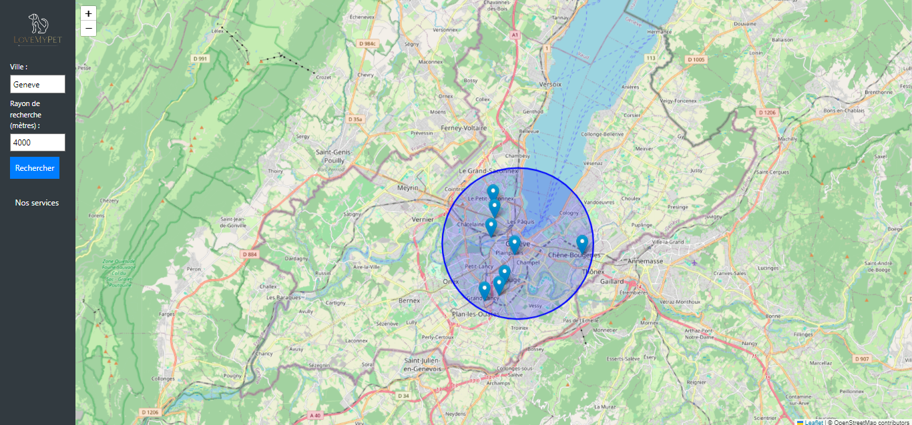

= Documentation de l'application LoveMyPet
:doctype: book
:icons: font
:source-highlighter: coderay
:toc: left
:toc-title: Table des matières

== Partie 1 : Synthèse 

=== titre du projet 

Le titre qu'on a choisi pour notre projet est **LoveMyPet**.

=== Abréviation 

L'abréviation  qu'on a choisi pour notre projet est **LMP**.

=== Logo 
Pour le logo du projet, on a crée le logo suivant :

image::logo.png[logo de lovemypet]

==== Membres de l'équipe

Le projet LoveMyPet a été réalisé par les membres suivants : 

    Imane Errahmani
    
    Adenle Sadikou

    Malek Messaoudi

=== Présentation

==== Contexte 

Les animaux de compagnie apportent la joie et le soutien émotionnel, cependant, leur adoption peut être un processus très complexe et parfois décourageant, tant pour les futurs adoptants que pour les animaux en attente de foyer. Faciliter l’adoption d’animaux de compagnie n’est pas seulement une question de confort, c’est une opportunité pour sauver des vies et créer des connexions durables entre les animaux et leurs propriétaires.

==== Problématique 

Le processus d'adoption des animaux de compagnie présente actuellement des défis significatifs tant pour les donneurs que pour les adoptants. Les principales problématiques identifiées sont les suivantes :

**Complexité du Processus**: Les plateformes existantes se concentrent principalement sur la mise en relation avec des refuges ou des associations, rendant le processus d'adoption complexe et bureaucratique.

**Suivi du Bien-Être des Animaux**: Après l'adoption, il existe un manque de mécanismes efficaces pour assurer le suivi du bien-être des animaux, ce qui peut entraîner une négligence involontaire.

**Manque de Flexibilité**: Les plateformes actuelles ne permettent pas aux donneurs de spécifier la durée de disponibilité de l'animal, limitant ainsi les options d'adoption temporaire.

==== Gain attendu 

En abordant ces problématiques, notre projet, LoveMyPet, vise à apporter les améliorations suivantes :

**Simplification du Processus d'Adoption**: Offrir une plateforme conviviale où les donneurs peuvent directement mettre en contact des personnes désireuses d'adopter, simplifiant ainsi le processus.

**Suivi Continu du Bien-Être**: Introduire un système de suivi du bien-être des animaux, incluant des rappels pour les vaccinations et d'autres aspects cruciaux, pour garantir une vie épanouissante après l'adoption.

**Flexibilité dans l'Adoption**: Permettre aux donneurs de spécifier la durée de disponibilité de l'animal, offrant ainsi des options d'adoption temporaire et permanente, selon les préférences des utilisateurs.

==== Motivation de l'équipe par rapport au sujet

La motivation principale de notre projet est la volonté de simplifier le processus de l’adoption des animaux de compagnie et d'améliorer leur bien-être.
On vise à créer une plateforme dont l’objectif est de connecter les adoptants potentiels avec les gens qui souhaitent donner leur animal de compagnie soit pour une durée définie (vacances) ou pour toujours.

Notre projet vise aussi à éduquer les futurs propriétaires sur les meilleures pratiques de soins afin de créer une communauté engagée et responsable pour contribuer à une adoption plus répandue et à des vies animales plus épanouies. 

==== Concurrence

Afin de faire une étude de la concurrence, on s’est posé les questions suivantes : 

Qui sont nos concurrents ?
Où sont-ils ?
Que proposent-ils ?
Quelles sont leurs forces et leurs faiblesses ?

Après une recherche sur internet, on a vu qu' en France, il existe beaucoup de sites web permettant l’adoption des animaux que ce soit des sites des fondations (Fondation 30 Millions d’amis, Fondation Brigitte Bardot…)  ou des plateformes d’adoption comme Seconde Chance, La-Spa.fr, PAAW…

On a constaté que sur ces sites web, le service proposé est de mettre en contact un futur adoptant avec une association de la protection des animaux ou avec un refuge, cela est totalement différent du service proposé par notre projet qui est de mettre en contact deux personnes, une qui souhaite donner son animal de compagnie soit de façon définitive ou pour une durée précise (vacance) et l’autre qui représente un futur propriétaire de cet animal.

En revanche ce service peut être existant dans des sites comme LeBonCoin, sauf que dans ce cas, ce site n’est pas dédié seulement aux animaux et leur adoption ce qui n’est pas pratique pour les utilisateurs souhaitant profiter d’un processus d’adoption simple et efficace. 

Ce qui diffère notre projet des concurrents cités, c’est le fait que c’est un site qui permet un suivi du bien être des animaux, cela inclut :
Trouver un propriétaire pour l’animal,
Assurer que le propriétaire prend soin de l’animal en lui envoyant des rappels pour nourrir l’animal, le laver, le vacciner…

Donc au final, notre projet est une combinaison de fonctionnalités permettant une meilleure expérience utilisateur.

==== Personas 

**Donneur d'Animal - Sophie**:

image::sophie.jpg[persona 1]

    Contexte: Sophie, 35 ans, a un chien nommé Max qu'elle aime profondément. Cependant, en raison de changements de vie, elle doit trouver un nouveau foyer pour Max.
    Fonctionnalités Clés:
        Enregistrement facile des informations de Max sur la plateforme.
        Possibilité de donner Max pour une durée à spécifier (temporaire ou permanente).

**Futur Adoptant - Antoine**:

image::antoine.jpg[persona 2]

    Contexte: Antoine, 28 ans, cherche un compagnon animal. Il aimerait adopter un chien pour lui tenir compagnie.
    Fonctionnalités Clés:
        Recherche simplifiée d'animaux disponibles à l'adoption.
        Faire une candidature  pour exprimer son intérêt à adopter.
        Accès à des informations complètes sur les vaccinations et le suivi du bien-être de l'animal.

==== Prévisions Marketing

**Réseaux Sociaux**:

Stratégie: Campagnes engageantes sur des plateformes populaires telles que Facebook, Instagram et Twitter.
Contenu: Témoignages d'adoptions réussies, conseils de soins, et mises en avant des fonctionnalités uniques de LoveMyPet.
Impact Attendu: Augmentation de la notoriété de la plateforme, engagement de la communauté, partages sociaux.

**Site Web**:

Stratégie: Développement d'un site web attrayant et convivial.
Contenu: Histoires inspirantes, guides de soins, témoignages d'utilisateurs, et accès facile aux fonctionnalités de la plateforme.
Impact Attendu: Plateforme centrale pour les informations sur LoveMyPet, conversion des visiteurs en utilisateurs actifs.

**Campagnes d'Influenceurs**:

Stratégie: Partenariat avec des influenceurs dans le domaine des animaux et de l'adoption responsable.
Contenu: Contenu authentique mettant en avant l'utilité de LoveMyPet.
Impact Attendu: Atteinte d'un public plus large, renforcement de la confiance grâce à des recommandations d'influenceurs.

== Partie 2 : Aspects techniques

=== type d'application

LoveMyPet est une application **web**

=== Schéma architectural de l'application

Voici notre schéma architectural 

[plantuml]
----
@startuml

!define RECTANGLE class
!define INTERFACE interface
!define END end

RECTANGLE Frontend {
  PageAccueil
  PagesProfil
  PagesAdoption
  PopUpsInteractifs
  PagesSuiviDeVaccination
  ...
}

RECTANGLE Backend {
  API_REST
  GestionUtilisateurs
  LogiqueAdoption
  SuiviVaccination
}

RECTANGLE BaseDeDonnees {
  TablesPerson
  TablesAnimal
  TablesAdoption
  TablesVaccination
  TablesVaccin
}

Backend -- BaseDeDonnees : communique
Frontend -- Backend : communique

@enduml
----

et voici toutes les API utilisées dans notre projet : 

===== AdoptionController

Point de départ de l'API : `/adoption`

* `GET /adoptions` : Obtenir la liste de toutes les URL d'adoption.
* `GET /{idAdoption}` : Obtenir les détails d'une adoption spécifique par ID.

===== AnimalController

Point de départ de l'API : `/animal`

* `POST /add` : Ajouter un nouvel animal avec un fichier image.
* `GET /person/{idPerson}` : Obtenir la liste des références d'animaux par ID de personne.
* `GET /{id}` : Obtenir les détails d'un animal spécifique par ID.
* `GET /{animalId}/candidatures` : Obtenir la liste des candidatures pour un animal spécifique.
* `POST /addadoption` : Ajouter une nouvelle adoption.

===== CandidatureController

Point de départ de l'API : `/animal/{animalId}/candidature`

* `GET /{candidatureId}` : Obtenir les détails d'une candidature spécifique pour un animal.

===== MesCandidatureController

Point de départ de l'API : `/mescandidature`

* `GET /person/{idPerson}` : Obtenir la liste des références de candidatures par ID de personne.
* `GET /{idCandidature}` : Obtenir les détails d'une candidature spécifique par ID.

===== PersonController

Point de départ de l'API : `/person`

* `GET /{id}` : Obtenir les détails d'une personne spécifique par ID.
* `POST /add` : Ajouter une nouvelle personne avec un fichier image.
* `POST /login` : Authentifier une personne à l'aide de l'e-mail et du mot de passe.
* `GET /profile` : Obtenir les informations du profil utilisateur.
* `POST /addcandidature` : Ajouter une nouvelle candidature.

===== VaccinationController

Point de départ de l'API : `/vaccination`

* `GET /animal/{idAnimal}` : Obtenir les références de vaccination par ID d'animal.
* `GET /{idVaccination}` : Obtenir les détails d'une vaccination spécifique par ID.
* `POST /add` : Ajouter une nouvelle vaccination.

===== VaccinController

Point de départ de l'API : `/vaccin`

* `GET /all` : Obtenir toutes les vaccinations.

==== plateforme technologique

**Langages utilisés**

**Backend (Java)**: Utilisation de Java pour la logique métier, la gestion de la base de données, et la création de l'API REST.

**Frontend (JavaScript, HTML, JSON)**: Utilisation de JavaScript pour la logique côté client, HTML pour la structure des pages, et JSON pour le format des données échangées.

**API REST**

Utilisation d'une architecture RESTful pour la communication entre le frontend et le backend.

**Frameworks de Test**

**Jacoco**: Utilisation de Jacoco pour la mesure de la couverture de code, permettant d'évaluer l'étendue des tests effectués sur le code source Java.

**Gestion de Versions**

**Git**: Utilisation du système de gestion de versions Git pour le suivi des modifications, la collaboration entre les membres de l'équipe, et la gestion des branches de développement.

**Build**

**Maven**: Utilisation de Maven pour la gestion des dépendances, la compilation du code source, et la création d'artefacts binaires.

**Intégration Continue (CI)**

**GitAction**: Mise en place d'un système d'intégration continue pour automatiser les tests, la compilation, et la vérification de la qualité du code à chaque modification dans le référentiel Git.

= Documentation Complète de l'Application

== Partie 1 : Modélisation

=== Fonctionnalité d'Adoption des Animaux

Une fonctionnalité essentielle de notre application est l'adoption d'animaux, offrant une expérience conviviale pour faciliter le processus.

==== Ajout d'Animaux dans "Mes Animaux"

Après avoir ajouté des compagnons dans la section "Mes Animaux", chaque animal est associé au bouton unique "Donner". Cela déclenche un pop-up interactif pour faciliter l'adoption.

**étape 1**

image::enregistrement.png[etape 1]

**étape 2**

image::donner.png[etape 2]

**étape 3**

image::popup.png[etape 3]

==== Configuration des Dates pour l'Adoption

Dans le pop-up, la date de début est obligatoire, indiquant quand l'animal sera disponible pour adoption. La date de fin est facultative, laissant aux donateurs le choix de l'adoption permanente ou temporaire, idéal pour les périodes comme les vacances.

==== Affichage dans la Section "Adoption"

Une fois configuré, l'animal est répertorié dans la section dédiée à l'adoption, avec un bouton "Candidater" pour exprimer l'intérêt.

**étape 4**

image::adoption.png[etape 4]

Cette approche flexible simplifie l'adoption, laissant aux propriétaires le choix de la durée d'adoption.

==== Gestion des Candidatures

Chaque animal ajouté à la section "Mes Animaux" est équipé d'un bouton "Candidatures". Ce bouton permet au propriétaire de consulter les détails des personnes ayant postulé pour garder son animal.

*étape 5*

image::candidatures.png[etape 5]

Le propriétaire peut ensuite examiner chaque candidature individuellement et décider d'accepter ou de refuser.

*étape 6*

image::accepter_refuser.png[etape 6]

=== Petite feature pour l'affichage et la modification des informations des Animaux

Chaque animal dans la section "Mes Animaux" est doté d'un bouton en haut à droite avec le signe plus (+). En cliquant sur ce bouton, les informations détaillées de l'animal sont affichées, offrant la possibilité de modifier le nom, le poids et la photo de l'animal.

image::accepter_refuser.png[etape 6]

image::accepter_refuser.png[etape 6]

=== Fonctionnalité de Suivi des Vaccins - Carnet de Vaccination en Ligne

La fonction de suivi des vaccins offre une gestion centralisée des vaccinations des animaux. Accessible depuis "Mes Animaux", elle permet aux propriétaires de maintenir un carnet de vaccination en ligne.

==== Accès Simple

**étape 1**
image::suivi_vaccins.png[etape 1]

**étape 2**
image::mes_animaux.png[etape 2]

==== Vue d'Ensemble des Vaccinations

L'interface propose une vue d'ensemble détaillée des vaccinations, incluant le nom et la date de chaque vaccin.

==== Ajout de Vaccinations

Les propriétaires peuvent ajouter de nouvelles vaccinations à tout moment, garantissant un historique complet et à jour.

=== Fonctionnalité de recherche des Vétérinaires et Jardins à Proximité

L'application offre une fonctionnalité avancée permettant aux utilisateurs de localiser rapidement des vétérinaires ou des jardins à proximité de leur emplacement actuel. Cette fonctionnalité est accessible depuis la page "Mes Services".

== Utilisation de la Carte depuis la Page "Mes Services"

=== Accès à la Page "Mes Services"

Connectez-vous à votre compte sur le site et accédez à la page "Mes Services".

=== Option "Trouver un Service"

Recherchez l'option "EXPLORATION FACILE" sur la page "Mes Services" et cliquez dessus.

image::service.jpeg[Services]

=== Choix entre Vétérinaires et Jardins

Une fois sur la page "EXPLORATION FACILE", les utilisateurs ont deux choix :
- "Trouver un Vétérinaire"
- "Rechercher un Jardin pour se Balader"
- "Recherche par Ville et Périmètre"

Les utilisateurs peuvent sélectionner l'option qui correspond à leur recherche.

image::map.png[Map]

== Requête vers l'API Overpass et Nominatim

=== Trouver un Vétérinaire :

Lorsque l'utilisateur choisit "Trouver un Vétérinaire", l'application utilise l'API Overpass pour rechercher les vétérinaires à proximité de la position actuelle de l'utilisateur. La requête à l'API Overpass est générée dynamiquement pour récupérer les nœuds correspondant à la catégorie "amenity=veterinary" dans un rayon défini autour de la position de l'utilisateur.

En outre, l'application utilise l'API Nominatim pour convertir le nom de la ville saisi par l'utilisateur en coordonnées géographiques.

[plantuml]
----
class VeterinairesController {
    +getVeterinaires(double latitude, double longitude, String city, int radius): String
    -Veterinary
}

class Veterinary {
    -lat: double
    -lon: double
    -name: String

    +Veterinary(double lat, double lon, String name)
    +getLat(): double
    +getLon(): double
    +getName(): String
}

class RestTemplate {
    +getForObject(url: String, responseType: Class<T>): T
}

VeterinairesController --> Veterinary: "1..*"
VeterinairesController --> RestTemplate: makeApiCall()
RestTemplate --> API: Overpass API
RestTemplate --> API: Nominatim API
----

- === Rechercher un Jardin pour se Balader :

Si l'utilisateur opte pour "Rechercher un Jardin pour se Balader", l'application effectue une requête pour trouver les nœuds correspondant à la catégorie "leisure=garden" autour de la position actuelle de l'utilisateur. Cette requête est également générée dynamiquement pour récupérer les informations nécessaires.

== Affichage des Résultats sur la Carte

- === Trouver un Vétérinaire :

Les résultats de la requête pour les vétérinaires sont affichés sur la carte sous forme de marqueurs. Chaque marqueur représente l'emplacement d'un vétérinaire trouvé.

image::veterinaire.png[Vétérinaire]
=== Recherche par ville "Geneve":

- === Rechercher un Jardin pour se Balader :

Pour la recherche de jardins, les résultats correspondants aux nœuds "leisure=garden" sont affichés sur la carte.

image::Parc.png[Parc]

=== Explication de l'API Overpass et Nominatim

L'API Overpass est un service d'interrogation et d'analyse de données OpenStreetMap. Elle permet de récupérer des données géographiques en utilisant un langage de requête spécifique. Dans le contexte de cette application, elle est utilisée pour obtenir des informations sur les vétérinaires et les jardins à proximité en fonction de la position de l'utilisateur. Les requêtes sont construites dynamiquement pour cibler les catégories spécifiques (amenity=veterinary, leisure=garden) et les résultats sont intégrés à la carte de l'application.

== Interaction avec les Avis

image::images_planification_food/7.png[advice]

Dans cette sous-branche, les utilisateurs ont la possibilité d'interagir avec les avis en les consultant, en les likant, ou en les dislikant. Cette fonctionnalité permet d'exprimer des réactions vis-à-vis des conseils postés par d'autres utilisateurs.

=== Consulter les Avis

Les utilisateurs peuvent parcourir les avis postés par d'autres membres de la communauté LoveMyPet. Ces avis peuvent contenir des conseils utiles, des expériences personnelles, ou des informations pertinentes sur les animaux de compagnie.

=== Liker un Avis

Chaque utilisateur a la possibilité de manifester son appréciation envers un avis en utilisant la fonction "Like". Lorsqu'un utilisateur clique sur le bouton "Like" d'un avis, cela indique une réaction positive envers le contenu de cet avis.

=== Disliker un Avis

De même, les utilisateurs peuvent exprimer leur désaccord ou leur mécontentement envers un avis en utilisant la fonction "Dislike". Cliquer sur le bouton "Dislike" signifie que l'utilisateur n'est pas en accord avec le contenu de l'avis.

Ces interactions permettent de créer une dynamique communautaire où les utilisateurs peuvent partager leurs opinions et réagir aux conseils des autres membres.

Les actions de "Like" et "Dislike" sont enregistrées dans la base de données, fournissant ainsi des informations sur la popularité et la réception des avis au sein de la communauté LoveMyPet.

Ces fonctionnalités contribuent à renforcer l'engagement des utilisateurs et favorisent une communauté active et collaborative.

== Fonctionnalité de Gestion des Animaux Perdus

La section "Animaux Perdus" de LoveMyPet propose une fonctionnalité permettant aux utilisateurs de déclarer et de retrouver leurs compagnons perdus. Lorsque vous accédez à cette section depuis la page "Nos Services", vous trouverez deux boutons distincts : "Déclarer un Animal Perdu" et "Liste des Animaux Perdus".

    Déclarer un Animal Perdu :
    En cliquant sur ce bouton, les utilisateurs peuvent remplir un formulaire pour déclarer un animal perdu. Ils peuvent fournir des détails tels que le nom de l'animal, une description, une photo, et d'autres informations pertinentes.

    Liste des Animaux Perdus :
    Ce bouton affiche une liste des animaux perdus déclarés par la communauté LoveMyPet. Les utilisateurs peuvent parcourir cette liste pour retrouver des animaux perdus et faciliter des réunions chaleureuses entre les amis à fourrure égarés et leurs propriétaires.
L'API Nominatim est utilisée pour convertir le nom de la ville saisi par l'utilisateur en coordonnées géographiques, ce qui permet d'étendre la fonctionnalité de recherche par ville et périmètre.

= Fonctionnalité de Planification des Heures de Repas et Envoi de Mails

== Introduction
La fonctionnalité de planification des heures de repas et d'envoi de mails de LoveMyPet permet aux utilisateurs de définir des horaires de repas pour leurs animaux de compagnie et de recevoir des rappels par e-mail à ces heures programmées. Cette documentation explique comment utiliser la page dédiée à cette fonctionnalité, basée sur le code HTML fourni.

image::images_planification_food/3.png[Planification de repas]

== Contenu de la Page HTML
La page HTML fournie contient un formulaire pour ajouter des alertes d'alimentation, une liste d'alertes existantes avec des options pour les supprimer ou les modifier, et des scripts JavaScript pour interagir avec l'API et gérer les fonctionnalités associées.

=== Structure HTML
La structure de la page HTML est composée des éléments suivants :
- Bouton de redirection vers la page "Mes animaux."
- Titre "Mes alertes."
- Message indiquant la réception de mails.
- Formulaire pour ajouter une alerte avec champ d'heure et bouton "Créer une alerte."
- Tableau affichant les heures de repas programmées avec options pour les supprimer ou les éditer.

=== Scripts JavaScript
Plusieurs scripts JavaScript sont inclus pour gérer la récupération, l'affichage, la suppression et la modification des horaires de repas à partir de l'API.

=== Fonctionnalités Principales

=== 1. Affichage des Horaires de Repas
La fonction `fetchFeedingTimes(animalId)` récupère les horaires de repas depuis l'API et les affiche dans le tableau sur la page.

=== 2. Ajout d'une Alerte d'Alimentation
La fonction `submitForm()` récupère l'heure saisie par l'utilisateur, envoie une requête POST à l'API pour créer une nouvelle alerte, puis met à jour l'affichage.

=== 3. Suppression d'une Alerte d'Alimentation
La fonction `deleteFeedingTime(id)` envoie une requête DELETE à l'API pour supprimer l'alerte d'alimentation spécifiée par l'ID.

=== 4. Modification d'une Alerte d'Alimentation
La fonction `updateFeedingTime(id)` permet à l'utilisateur de mettre à jour l'heure d'une alerte existante en envoyant une requête PUT à l'API.

=== 5. Envoi de Mails de Rappel
Chaque heure planifiée, un e-mail de rappel est automatiquement envoyé à l'utilisateur, l'informant de l'heure de repas prévue pour son animal.

image::images_planification_food/4.png[Exemple d'email envoyé a l'utilisateur]

=== Utilisation de la Page
1. Accédez à la page via le bouton "Mes animaux."
2. Ajoutez de nouvelles alertes d'alimentation en spécifiant l'heure et en cliquant sur "Créer une alerte."
3. Consultez et gérez les alertes existantes dans le tableau.
4. Recevez des rappels par e-mail à chaque heure programmée.

=== Confirmation de l'E-mail

Pour confirmer la réception de l'e-mail et l'alimentation de l'animal, l'utilisateur peut cliquer sur le bouton de confirmation présent dans l'e-mail. Lorsqu'il le fait, un message de réussite est affiché, et une nouvelle ligne est insérée dans la base de données pour enregistrer la confirmation.

Le bouton de confirmation dans l'e-mail doit rediriger l'utilisateur vers une page ou un endpoint dédié, par exemple :

[source,html]
----
<a href="/feeding-confirmation/confirm?personId=1&amp;animalId=1&amp;feedingTimeId=39&amp;confirmationCode=ad97faf5">Confirmer</a>
----

Lorsque l'utilisateur clique sur ce lien, une requête est envoyée à l'API pour confirmer la réception de l'e-mail. Cette requête déclenche l'insertion d'une nouvelle ligne dans la base de données avec les informations associées à la confirmation.

Voici un exemple de structure de la table dans la base de données :

[source,sql]
----
CREATE TABLE confirmation_table (
    id SERIAL PRIMARY KEY,
    animal_id INTEGER,
    confirmation_code VARCHAR(255),
    confirmation_date TIMESTAMP,
    feeding_time_id INTEGER,
    person_id INTEGER
);
----

Chaque confirmation est enregistrée avec les informations suivantes :
- `id`: Identifiant unique de la confirmation (auto-incrémenté).
- `animal_id`: Identifiant de l'animal concerné.
- `confirmation_code`: Code de confirmation associé à l'e-mail.
- `confirmation_date`: Date et heure de la confirmation.
- `feeding_time_id`: Identifiant de l'horaire d'alimentation associé.
- `person_id`: Identifiant de la personne effectuant la confirmation.

Lorsqu'un utilisateur confirme l'e-mail, une nouvelle ligne est ajoutée à la table avec les données appropriées. Cette approche permet de suivre les confirmations pour chaque animal, chaque horaire d'alimentation, et chaque personne.

Cette fonctionnalité offre une trace complète des confirmations et permet de garantir que les utilisateurs ont bien alimenté leurs animaux selon les horaires programmés.

image::images_planification_food/5.png[Message]

image::images_planification_food/6.png[Ligne dans la table feeding confirmation]

=== API de la fonctionnalité

==== Ajout d'un Horaire d'Alimentation
Endpoint : `POST /api/feeding-times/add`
Cette API permet d'ajouter un nouvel horaire d'alimentation. Elle accepte une requête POST avec les détails de l'horaire dans le corps de la requête. En cas de succès, elle renvoie un message indiquant que l'horaire a été ajouté avec succès. En cas d'erreur, elle peut retourner des messages spécifiques, tels que la détection d'un conflit si l'horaire existe déjà.

==== Liste des Horaire d'Alimentation pour un Animal
Endpoint : `GET /api/feeding-times/{idAnimal}`
Cette API renvoie la liste des horaires de repas associés à un animal spécifié par son ID. Les horaires sont renvoyés sous forme de liste de chaînes.

==== Détail d'un Horaire d'Alimentation
Endpoint : `GET /api/feeding-times/time/{id}`
Cette API renvoie les détails d'un horaire d'alimentation spécifié par son ID. Si l'horaire existe, elle renvoie les détails de l'horaire sous forme d'objet. Sinon, elle retourne une réponse "Not Found."

==== Suppression d'un Horaire d'Alimentation
Endpoint : `DELETE /api/feeding-times/delete/{id}`
Cette API permet de supprimer un horaire d'alimentation en spécifiant son ID. En cas de succès, elle renvoie un message indiquant que l'horaire a été supprimé avec succès. En cas d'erreur, elle peut retourner un message générique d'erreur interne du serveur.

==== Mise à Jour d'un Horaire d'Alimentation
Endpoint : `PUT /api/feeding-times/update/{id}`
Cette API permet de mettre à jour un horaire d'alimentation en spécifiant son ID. Elle accepte une requête PUT avec les détails mis à jour dans le corps de la requête. En cas de succès, elle renvoie un message de mise à jour réussie. En cas d'erreur, elle peut retourner un message d'erreur spécifique.

==== Récupération des Horaire d'Alimentation Actuels pour les E-mails
Endpoint : `GET /api/feeding-times/email-animal-current-feeding-times`
Cette API renvoie une liste d'informations sur les horaires de repas actuels pour lesquels des e-mails de rappel doivent être envoyés. Les informations sont renvoyées sous forme de liste d'objets. En cas de succès, elle renvoie la liste des horaires. En cas d'absence de données, elle renvoie une réponse "No Content." En cas d'erreur, elle peut retourner une réponse générique d'erreur interne du serveur.

---

== Partie 3 : Modélisation

[plantuml]
----
@startuml

package com.nanterre.LoveMyPet.controller {
  class AdoptionController {
    + getAllAdoptionUrls(): List<String>
    + getAdoptionDetails(idAdoption: Integer): Map<String, Object>
    + addAdoption(adoption: Adoption): ResponseEntity<Map<String, String>>
  }
  class AnimalController {
    + addAnimal(imageFile: MultipartFile, animal: Animal): ResponseEntity<String>
    + getAnimalsReferenceByPersonId(idPerson: Integer): List<String>
    + getAnimalDetailsById(id: Integer): Animal
    + getCandidaturesByAnimalId(animalId: Integer): List<String>
    + addAdoption(adoption: Adoption): ResponseEntity<Map<String, String>>
  }
  class CandidatureController {
    + getCandidatureDetailsByAnimalIdAndCandidatureId(animalId: Integer, candidatureId: Integer): Candidature
  }
  class Controller {
    + showAdoptionPage(model: Model): String
    + showAnimals(model: Model): String
    + showCandidatureByAnimalId(model: Model): String
    + showVaccinations(model: Model): String
    + showCandidatures(model: Model): String
    + showpage(): String
    + showpageaddAnimal(): String
    + showpagelogin(): String
    + homePage(): String
    + profile(): String
  }
  class MesCandidatureController {
    + getCandidatureReferenceByPersonId(idPerson: Integer): List<String>
    + getCandidatureDetailsById(idCandidature: Integer): Candidature
  }
  class PersonController {
    + getPersonDetailsById(id: Integer): Person
    + add(imageFile: MultipartFile, person: Person): ResponseEntity<String>
    + login(email: String, password: String, session: HttpSession): ResponseEntity<?>
    + userProfile(session: HttpSession): ResponseEntity<?>
    + addCandidature(idPerson: Integer, idAdoption: Integer, dateCandidature: String): ResponseEntity<String>
  }
}

package com.nanterre.LoveMyPet.service {
  interface AdoptionService {
    + getAllAdoptionUrls(): List<String>
    + getAdoptionDetails(idAdoption: Integer): Map<String, Object>
    + saveAdoption(adoption: Adoption)
  }
  interface AnimalService {
    + getAnimalLinksByPersonId(idPerson: Integer): List<String>
    + getAnimalDetailsById(id: Integer): Animal
    + getAdoptionUrlsForAnimals(): List<String>
    + saveAnimal(animal: Animal): Animal
    + findAnimalById(id: Integer): Animal
  }
  interface CandidatureService {
    + getCandidatureLinksByAnimalId(animalId: Integer): List<String>
    + getCandidatureDetailsByAnimalIdAndCandidatureId(animalId: Integer, candidatureId: Integer): Candidature
    + saveCandidature(candidature: Candidature)
  }
  interface MesCandidatureService {
    + getCandidatureLinksByPersonId(idPerson: Integer): List<String>
    + getCandidatureDetailsById(idCandidature: Integer): Candidature
  }
  interface PersonService {
    + getPersonDetailsById(id: Integer): Person
    + savePerson(person: Person): Person
    + findPersonByEmail(email: String): Person
  }
}

package com.nanterre.LoveMyPet.repository {
  interface AdoptionRepository {
    + findAll(): List<Adoption>
    + findById(id: Integer): Optional<Adoption>
    + save(adoption: Adoption): Adoption
  }
  interface AnimalRepository {
    + findByIdPerson(idPerson: Integer): List<Animal>
    + findById(id: Integer): Optional<Animal>
    + save(animal: Animal): Animal
  }
  interface CandidatureRepository {
    + getCandidaturesByAnimalId(animalId: Integer): List<Candidature>
    + findById(id: Integer): Optional<Candidature>
    + save(candidature: Candidature): Candidature
  }
  interface MesCandidatureRepository {
    + findByPersonIdPerson(idPerson: Integer): List<Candidature>
    + findById(id: Integer): Optional<Candidature>
    + save(candidature: Candidature): Candidature
  }
  interface PersonRepository {
    + findById(id: Integer): Optional<Person>
    + save(person: Person): Person
    + findPersonByEmail(email: String): Person
  }
}

Controller --|> AdoptionController
Controller --|> AnimalController
Controller --|> CandidatureController
Controller --|> MesCandidatureController
Controller --|> PersonController

AdoptionController --|> AdoptionService
AdoptionController --|> AnimalService

AnimalController --|> AnimalService
AnimalController --|> AdoptionService
AnimalController --|> CandidatureService

CandidatureController --|> CandidatureService

MesCandidatureController --|> MesCandidatureService

PersonController --|> PersonService
PersonController --|> CandidatureService

AdoptionService --|> AdoptionRepository
AnimalService --|> AnimalRepository
CandidatureService --|> CandidatureRepository
MesCandidatureService --|> MesCandidatureRepository
PersonService --|> PersonRepository

@enduml
----

[plantuml]
----
@startuml

package com.nanterre.LoveMyPet.controller {
  class AnimalController {
    + addAnimal(imageFile: MultipartFile, animal: Animal): ResponseEntity<String>
    + getAnimalsReferenceByPersonId(idPerson: Integer): List<String>
    + getAnimalDetailsById(id: Integer): Animal
    + getCandidaturesByAnimalId(animalId: Integer): List<String>
    + addAdoption(adoption: Adoption): ResponseEntity<Map<String, String>>
  }
  class Controller {
    + showAdoptionPage(model: Model): String
    + showAnimals(model: Model): String
    + showCandidatureByAnimalId(model: Model): String
    + showVaccinations(model: Model): String
    + showCandidatures(model: Model): String
    + showpage(): String
    + showpageaddAnimal(): String
    + showpagelogin(): String
    + homePage(): String
    + profile(): String
  }
  class PersonController {
    + getPersonDetailsById(id: Integer): Person
    + add(imageFile: MultipartFile, person: Person): ResponseEntity<String>
    + login(email: String, password: String, session: HttpSession): ResponseEntity<?>
    + userProfile(session: HttpSession): ResponseEntity<?>
    + addCandidature(idPerson: Integer, idAdoption: Integer, dateCandidature: String): ResponseEntity<String>
  }
  class VaccinationController {
    + getVaccinationReferenceByAnimalId(idAnimal: Integer): List<String>
    + getVaccinationDetailsById(idVaccination: Integer): Vaccination
    + add(vaccination: Vaccination, animalId: Integer): String
  }

  class VaccinController {
    - vaccinService: VaccinService
    + VaccinController(vaccinService: VaccinService)
    + getAllVaccins(): Iterable<Vaccin>
  }
}

package com.nanterre.LoveMyPet.service {
  interface AnimalService {
    + getAnimalLinksByPersonId(idPerson: Integer): List<String>
    + getAnimalDetailsById(id: Integer): Animal
    + getAdoptionUrlsForAnimals(): List<String>
    + saveAnimal(animal: Animal): Animal
    + findAnimalById(id: Integer): Animal
  }
  interface PersonService {
    + getPersonDetailsById(id: Integer): Person
    + savePerson(person: Person): Person
    + findPersonByEmail(email: String): Person
  }
  interface VaccinationService {
    + saveVaccination(vaccination: Vaccination): Vaccination
    + getVaccinationLinksByAnimalId(idAnimal: Integer): List<String>
    + getVaccinationDetailsById(idVaccination: Integer): Vaccination
  }
  
  interface VaccinService {
  + getAllVaccins(): Iterable<Vaccin>
  + getVaccinById(id: Integer): Vaccin
  }

}

package com.nanterre.LoveMyPet.repository {
  interface AnimalRepository {
    + findByIdPerson(idPerson: Integer): List<Animal>
    + findById(id: Integer): Optional<Animal>
    + save(animal: Animal): Animal
  }
  interface PersonRepository {
    + findById(id: Integer): Optional<Person>
    + save(person: Person): Person
    + findPersonByEmail(email: String): Person
  }
  interface VaccinRepository {
    + findAll(): Iterable<Vaccin>
    + findById(id: Integer): Optional<Vaccin>
    + save(vaccin: Vaccin): Vaccin
    + deleteById(id: Integer): void
  }
  interface VaccinationRepository {
    + findAll(): List<Vaccination>
    + findById(id: Integer): Optional<Vaccination>
    + save(vaccination: Vaccination): Vaccination
    + deleteById(id: Integer): void
    + findByAnimalId(animalId: Integer): List<Vaccination>
  }
}

Controller --|> VaccinationController
Controller --|> AnimalController
Controller --|> VaccinController
Controller --|> PersonController

VaccinationController --|> VaccinationService
AnimalController --|> AnimalService
VaccinController --|> VaccinService
PersonController --|> PersonService

AnimalService --|> AnimalRepository
VaccinationService --|> VaccinationRepository
VaccinService --|> VaccinRepository
PersonService --|> PersonRepository

@enduml
----

== Base de données

Le diagramme entité-relation ci-dessous offre une représentation visuelle des relations essentielles. En mettant en lumière les liens entre les différentes entités.

=== Modèle LoveMyPet

[plantuml]
----
@startuml

package "com.nanterre.LoveMyPet.model" {
  class Person {
    +idPerson: Integer
    LastName: String
    FirstName: String
    Email: String
    PhoneNumber: String
    Address: String
    Password: String
    ImageUrl: String
  }

  class Animal {
    +id: Integer
    +idPerson: Integer
    name: String
    category: String
    race: String
    weight: Double
    gender: Integer
    dateOfBirth: Date
    imageUrl: String
  }

  class Adoption {
    +idAdoption: Integer
    startDate: Date
    endDate: Date
    +idAnimal: Integer
  }

  class Candidature {
    +idCandidature: Integer
    dateCandidature: Date
    +person: Person
    +adoption: Adoption
  }

  class Vaccin {
    +idVaccin: Integer
    vaccinName: String
  }

  class Vaccination {
    +idVaccination: Integer
    +vaccin: Vaccin
    +animal: Animal
    date: Date
  }

  class Advice {
    +idAdvice: Integer
    description: String
    +person: Person
    +animal: Animal
  }
  class LikeDislike {
    +id: Integer
    +advice: Advice
    +person: Person
    isLike: boolean
  }

  class FeedingConfirmation {
    +id: Integer
    +personId: Integer
    +animalId: Integer
    +feedingTimeId: Integer
    confirmationDate: Date
    confirmationCode: String
  }

  class FeedingTime {
    +id: Integer
    +feedingTime: LocalTime
  }
  class HistoriqueAdoption {
    +id: Integer
    +idAnimal: Integer
    +idPerson: Integer
    endDate: Date
    adoptedAnimal: Animal
    adoptedByPerson: Person
  }
  class LostAnimal {
  +id: Integer
  category: String
  person: Person
  name: String
  age: Integer
  race: String
  comment: String
  gender: String
  imageUrl: String
  lostDate: Date
}
}

Person   --  Animal : "1,1" Adopte "0,N"
Person -- Candidature : "0,N" Candidate à "1,1"
Animal -- Adoption : "1,1" Est concerné par "1,1"
Candidature -- Adoption : "1,1" Correspond à "0,N"
Vaccin -- Vaccination : "0,N" Est utilisé dans "1,N"
Vaccination -- Animal : "1,1" prend "1,N"
Person -- Advice : "0,N" Partage "1,N"
LikeDislike -- Person : "1,1" Est exprimé par "0,N"
Animal -- FeedingConfirmation : "1,1" Est concerné par "0,N"
FeedingTime -- FeedingConfirmation : "1,1" Planifie "0,N"
FeedingTime -- Animal : "1,1" Est associé à "0,N"
LikeDislike -- Advice : "0,N" Est associé à "1,N"
Person -- HistoriqueAdoption : "0,N" Enregistré "1,1"
HistoriqueAdoption -- Animal : "1,1" Concerne "0,N"
Person -- LostAnimal : "1,N" Perd "1,N"

@enduml

----
