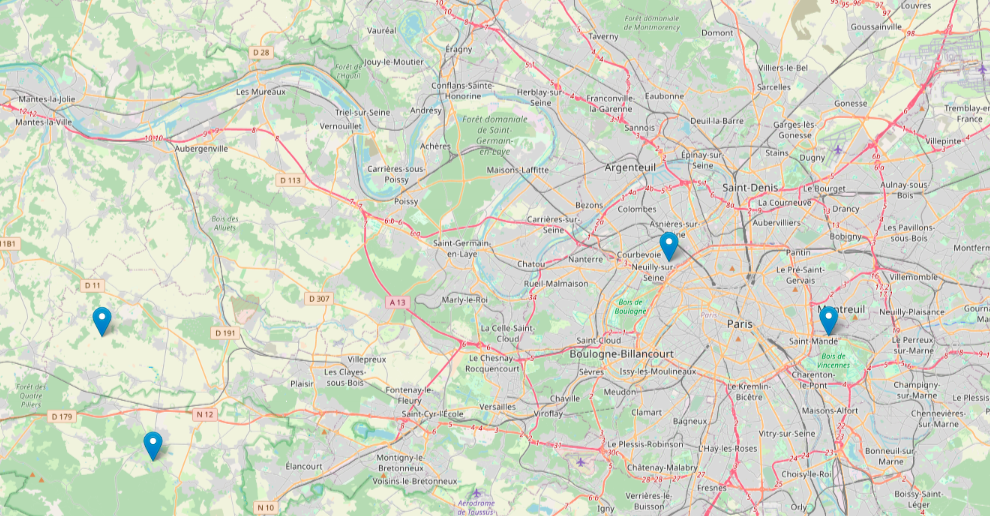
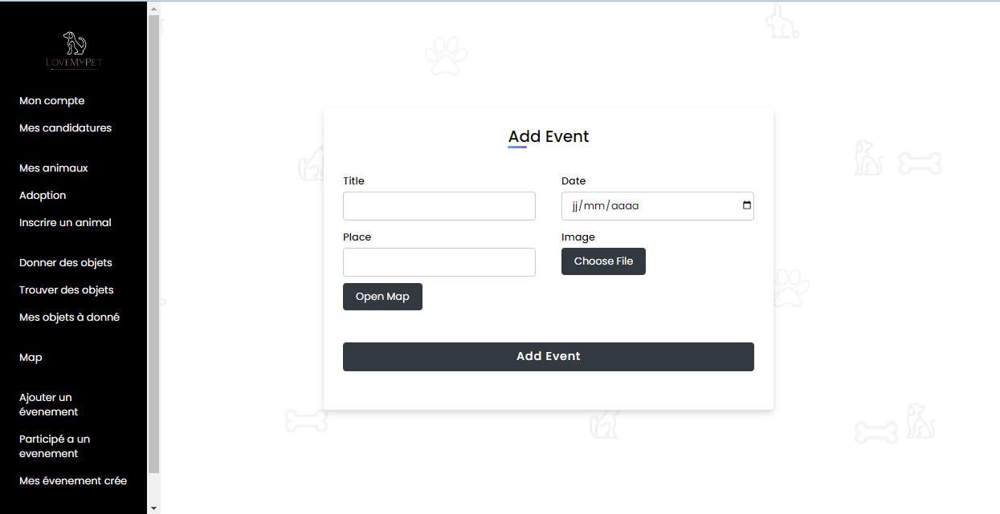

= Documentation de l'application LoveMyPet
:doctype: book
:icons: font
:source-highlighter: coderay
:toc: left
:toc-title: Table des matières

== Partie 1 : Synthèse 

=== titre du projet 

Le titre qu'on a choisi pour notre projet est **LoveMyPet**.

=== Abréviation 

L'abréviation  qu'on a choisi pour notre projet est **LMP**.

=== Logo 
Pour le logo du projet, on a crée le logo suivant :

image::logo.png[logo de lovemypet]

=== Membres de l'équipe

Le projet LoveMyPet a été réalisé par les membres suivants : 

    Imane Errahmani
    
    Adenle Sadikou

    Malek Messaoudi

=== Présentation

==== Contexte 

Les animaux de compagnie apportent la joie et le soutien émotionnel, cependant, leur adoption peut être un processus très complexe et parfois décourageant, tant pour les futurs adoptants que pour les animaux en attente de foyer. Faciliter l’adoption d’animaux de compagnie n’est pas seulement une question de confort, c’est une opportunité pour sauver des vies et créer des connexions durables entre les animaux et leurs propriétaires.

==== Problématique 

Le processus d'adoption des animaux de compagnie présente actuellement des défis significatifs tant pour les donneurs que pour les adoptants. Les principales problématiques identifiées sont les suivantes :

**Complexité du Processus**: Les plateformes existantes se concentrent principalement sur la mise en relation avec des refuges ou des associations, rendant le processus d'adoption complexe et bureaucratique.

**Suivi du Bien-Être des Animaux**: Après l'adoption, il existe un manque de mécanismes efficaces pour assurer le suivi du bien-être des animaux, ce qui peut entraîner une négligence involontaire.

**Manque de Flexibilité**: Les plateformes actuelles ne permettent pas aux donneurs de spécifier la durée de disponibilité de l'animal, limitant ainsi les options d'adoption temporaire.

==== Gain attendu 

En abordant ces problématiques, notre projet, LoveMyPet, vise à apporter les améliorations suivantes :

**Simplification du Processus d'Adoption**: Offrir une plateforme conviviale où les donneurs peuvent directement mettre en contact des personnes désireuses d'adopter, simplifiant ainsi le processus.

**Suivi Continu du Bien-Être**: Introduire un système de suivi du bien-être des animaux, incluant des rappels pour les vaccinations et d'autres aspects cruciaux, pour garantir une vie épanouissante après l'adoption.

**Flexibilité dans l'Adoption**: Permettre aux donneurs de spécifier la durée de disponibilité de l'animal, offrant ainsi des options d'adoption temporaire et permanente, selon les préférences des utilisateurs.

==== Motivation de l'équipe par rapport au sujet

La motivation principale de notre projet est la volonté de simplifier le processus de l’adoption des animaux de compagnie et d'améliorer leur bien-être.
On vise à créer une plateforme dont l’objectif est de connecter les adoptants potentiels avec les gens qui souhaitent donner leur animal de compagnie soit pour une durée définie (vacances) ou pour toujours.

Notre projet vise aussi à éduquer les futurs propriétaires sur les meilleures pratiques de soins afin de créer une communauté engagée et responsable pour contribuer à une adoption plus répandue et à des vies animales plus épanouies. 

==== Concurrence

Afin de faire une étude de la concurrence, on s’est posé les questions suivantes : 

Qui sont nos concurrents ?
Où sont-ils ?
Que proposent-ils ?
Quelles sont leurs forces et leurs faiblesses ?

Après une recherche sur internet, on a vu qu' en France, il existe beaucoup de sites web permettant l’adoption des animaux que ce soit des sites des fondations (Fondation 30 Millions d’amis, Fondation Brigitte Bardot…)  ou des plateformes d’adoption comme Seconde Chance, La-Spa.fr, PAAW…

On a constaté que sur ces sites web, le service proposé est de mettre en contact un futur adoptant avec une association de la protection des animaux ou avec un refuge, cela est totalement différent du service proposé par notre projet qui est de mettre en contact deux personnes, une qui souhaite donner son animal de compagnie soit de façon définitive ou pour une durée précise (vacance) et l’autre qui représente un futur propriétaire de cet animal.

En revanche ce service peut être existant dans des sites comme LeBonCoin, sauf que dans ce cas, ce site n’est pas dédié seulement aux animaux et leur adoption ce qui n’est pas pratique pour les utilisateurs souhaitant profiter d’un processus d’adoption simple et efficace. 

Ce qui diffère notre projet des concurrents cités, c’est le fait que c’est un site qui permet un suivi du bien être des animaux, cela inclut :
Trouver un propriétaire pour l’animal,
Assurer que le propriétaire prend soin de l’animal en lui envoyant des rappels pour nourrir l’animal, le laver, le vacciner…

Donc au final, notre projet est une combinaison de fonctionnalités permettant une meilleure expérience utilisateur.

==== Personas 

**Donneur d'Animal - Sophie**:

image::sophie.jpg[persona 1]

    Contexte: Sophie, 35 ans, a un chien nommé Max qu'elle aime profondément. Cependant, en raison de changements de vie, elle doit trouver un nouveau foyer pour Max.
    Fonctionnalités Clés:
        Enregistrement facile des informations de Max sur la plateforme.
        Possibilité de donner Max pour une durée à spécifier (temporaire ou permanente).

**Futur Adoptant - Antoine**:

image::antoine.jpg[persona 2]

    Contexte: Antoine, 28 ans, cherche un compagnon animal. Il aimerait adopter un chien pour lui tenir compagnie.
    Fonctionnalités Clés:
        Recherche simplifiée d'animaux disponibles à l'adoption.
        Faire une candidature  pour exprimer son intérêt à adopter.
        Accès à des informations complètes sur les vaccinations et le suivi du bien-être de l'animal.

==== Prévisions Marketing

**Réseaux Sociaux**:

Stratégie: Campagnes engageantes sur des plateformes populaires telles que Facebook, Instagram et Twitter.
Contenu: Témoignages d'adoptions réussies, conseils de soins, et mises en avant des fonctionnalités uniques de LoveMyPet.
Impact Attendu: Augmentation de la notoriété de la plateforme, engagement de la communauté, partages sociaux.

**Site Web**:

Stratégie: Développement d'un site web attrayant et convivial.
Contenu: Histoires inspirantes, guides de soins, témoignages d'utilisateurs, et accès facile aux fonctionnalités de la plateforme.
Impact Attendu: Plateforme centrale pour les informations sur LoveMyPet, conversion des visiteurs en utilisateurs actifs.

**Campagnes d'Influenceurs**:

Stratégie: Partenariat avec des influenceurs dans le domaine des animaux et de l'adoption responsable.
Contenu: Contenu authentique mettant en avant l'utilité de LoveMyPet.
Impact Attendu: Atteinte d'un public plus large, renforcement de la confiance grâce à des recommandations d'influenceurs.

== Partie 2 : Aspects techniques

=== type d'application

LoveMyPet est une application **web**

=== Schéma architectural de l'application

Voici notre schéma architectural 

[plantuml]
----
@startuml

!define RECTANGLE class
!define INTERFACE interface
!define END end

RECTANGLE Frontend {
  PageAccueil
  PagesProfil
  PagesAdoption
  PopUpsInteractifs
  PagesSuiviDeVaccination
  ...
}

RECTANGLE Backend {
  API_REST
  GestionUtilisateurs
  LogiqueAdoption
  SuiviVaccination
  LogiqueAlerts
  LogiqueSuiviDuPoids
  LogiqueAffichageDesparcs
  LogiqueAffichageDesVeterinaires
}

RECTANGLE BaseDeDonnees {
  TablesPerson
  TablesAnimal
  TablesAdoption
  TablesVaccination
  TablesVaccin
  TableAdvice
  TableCanidature
  TableComment
  TableFeedingConfirmation
  TableFeedingTime
  TableHistoriqueAdoption
  TableHistoriqueWeight
  TableLikeDislike
  TableLostAnimal
}

Backend -- BaseDeDonnees : communique
Frontend -- Backend : communique

@enduml
----

et voici toutes les API utilisées dans notre projet : 

===== AdoptionController

Point de départ de l'API : `/adoption`

* `GET /adoptions` : Obtenir la liste de toutes les URL d'adoption.
* `GET /{idAdoption}` : Obtenir les détails d'une adoption spécifique par ID.

===== AnimalController

Point de départ de l'API : `/animal`

* `POST /add` : Ajouter un nouvel animal avec un fichier image.
* `GET /person/{idPerson}` : Obtenir la liste des références d'animaux par ID de personne.
* `GET /{id}` : Obtenir les détails d'un animal spécifique par ID.
* `GET /{animalId}/candidatures` : Obtenir la liste des candidatures pour un animal spécifique.
* `POST /addadoption` : Ajouter une nouvelle adoption.

===== CandidatureController

Point de départ de l'API : `/animal/{animalId}/candidature`

* `GET /{candidatureId}` : Obtenir les détails d'une candidature spécifique pour un animal.

===== MesCandidatureController

Point de départ de l'API : `/mescandidature`

* `GET /person/{idPerson}` : Obtenir la liste des références de candidatures par ID de personne.
* `GET /{idCandidature}` : Obtenir les détails d'une candidature spécifique par ID.

===== PersonController

Point de départ de l'API : `/person`

* `GET /{id}` : Obtenir les détails d'une personne spécifique par ID.
* `POST /add` : Ajouter une nouvelle personne avec un fichier image.
* `POST /login` : Authentifier une personne à l'aide de l'e-mail et du mot de passe.
* `GET /profile` : Obtenir les informations du profil utilisateur.
* `POST /addcandidature` : Ajouter une nouvelle candidature.

===== VaccinationController

Point de départ de l'API : `/vaccination`

* `GET /animal/{idAnimal}` : Obtenir les références de vaccination par ID d'animal.
* `GET /{idVaccination}` : Obtenir les détails d'une vaccination spécifique par ID.
* `POST /add` : Ajouter une nouvelle vaccination.

===== VaccinController

Point de départ de l'API : `/vaccin`

* `GET /all` : Obtenir toutes les vaccinations.

===== HistoriqueAdoptionController

Point de départ de l'API : `/historiqueadoption`

* `POST /ajouteradoption` : ajouter une adoption temporaire dans la table.

===== HistoriqueWeightController

Point de départ de l'API : `/historiqueWeight`

* `GET /animal/{idAnimal}` : Récupérer la liste des liens d'historique de poids pour un animal donné.
*`GET /{id}` : Récupérer les détails d'un enregistrement d'historique de poids par son identifiant.
*`GET /data/{idAnimal}` : Récupérer les données d'historique de poids pour un animal donné.

===== InfoAnimalController

Point de départ de l'API : `/infoanimal`

* `GET /{idAnimal}` : Récupérer les informations concernant un animal à partir de son id
*`POST /updateName/{idAnimal}` : modifier le nom de l'animal dont l'identifiant est idAnimal.
*`POST /updateWeight/{idAnimal}` : modifier le poids de l'animal dont l'identifiant est idAnimal.
*`POST /updateImage/{idAnimal}` : modifier l'image de l'animal dont l'identifiant est idAnimal.

===== MesCandidatureController

Point de départ de l'API : `/mescandidature`

* `GET /person/{idPerson}` : Récupérer les liens des candidatures de la personne.
*`GET /{idCandidature}` : Récupérer la candidature.

==== plateforme technologique

**Langages utilisés**

**Backend (Java)**: Utilisation de Java pour la logique métier, la gestion de la base de données, et la création de l'API REST.

**Frontend (JavaScript, HTML, JSON)**: Utilisation de JavaScript pour la logique côté client, HTML pour la structure des pages, et JSON pour le format des données échangées.

**API REST**

Utilisation d'une architecture RESTful pour la communication entre le frontend et le backend.

**Frameworks de Test**

**Jacoco**: Utilisation de Jacoco pour la mesure de la couverture de code, permettant d'évaluer l'étendue des tests effectués sur le code source Java.

**Gestion de Versions**

**Git**: Utilisation du système de gestion de versions Git pour le suivi des modifications, la collaboration entre les membres de l'équipe, et la gestion des branches de développement.

**Build**

**Maven**: Utilisation de Maven pour la gestion des dépendances, la compilation du code source, et la création d'artefacts binaires.

**Intégration Continue (CI)**

**GitAction**: Mise en place d'un système d'intégration continue pour automatiser les tests, la compilation, et la vérification de la qualité du code à chaque modification dans le référentiel Git.

= Documentation Complète de l'Application

== Partie 1 : Modélisation

Après avoir ajouté des compagnons dans la section "Mes Animaux", chaque animal est associé au bouton unique "Donner". Cela déclenche un pop-up interactif pour faciliter l'adoption.

**étape 1**

**étape 2**

image::donner.png[etape 2]

**étape 3**

image::popup.png[etape 3]

==== Configuration des Dates pour l'Adoption

Dans le pop-up, la date de début est obligatoire, indiquant quand l'animal sera disponible pour adoption. La date de fin est facultative, laissant aux donateurs le choix de l'adoption permanente ou temporaire, idéal pour les périodes comme les vacances.

==== Affichage dans la Section "Adoption"

Une fois configuré, l'animal est répertorié dans la section dédiée à l'adoption, avec un bouton "Candidater" pour exprimer l'intérêt.

**étape 4**

image::adoption.png[etape 4]

Cette approche flexible simplifie l'adoption, laissant aux propriétaires le choix de la durée d'adoption.

==== Gestion des Candidatures

Chaque animal ajouté à la section "Mes Animaux" est équipé d'un bouton "Candidatures". Ce bouton permet au propriétaire de consulter les détails des personnes ayant postulé pour garder son animal.

*étape 5*

Le propriétaire peut ensuite examiner chaque candidature individuellement et décider d'accepter ou de refuser.

*étape 6*

=== Petite feature pour l'affichage et la modification des informations des Animaux

Chaque animal dans la section "Mes Animaux" est doté d'un bouton en haut à droite avec le signe plus (+). En cliquant sur ce bouton, les informations détaillées de l'animal sont affichées, offrant la possibilité de modifier le nom, le poids et la photo de l'animal.

=== Fonctionnalité de Suivi des Vaccins - Carnet de Vaccination en Ligne

La fonction de suivi des vaccins offre une gestion centralisée des vaccinations des animaux. Accessible depuis "Mes Animaux", elle permet aux propriétaires de maintenir un carnet de vaccination en ligne.

==== Accès Simple

**étape 1**
image::suivi_vaccins.png[etape 1]

**étape 2**
image::mes_animaux.png[etape 2]

==== Vue d'Ensemble des Vaccinations

L'interface propose une vue d'ensemble détaillée des vaccinations, incluant le nom et la date de chaque vaccin.

==== Ajout de Vaccinations

Les propriétaires peuvent ajouter de nouvelles vaccinations à tout moment, garantissant un historique complet et à jour.

=== Fonctionnalité de recherche des Vétérinaires et Jardins à Proximité

L'application offre une fonctionnalité avancée permettant aux utilisateurs de localiser rapidement des vétérinaires ou des jardins à proximité de leur emplacement actuel. Cette fonctionnalité est accessible depuis la page "Mes Services".

== Utilisation de la Carte depuis la Page "Mes Services"

=== Accès à la Page "Mes Services"

Connectez-vous à votre compte sur le site et accédez à la page "Mes Services".

=== Option "Trouver un Service"

Recherchez l'option "EXPLORATION FACILE" sur la page "Mes Services" et cliquez dessus.

image::service.jpeg[Services]

=== Choix entre Vétérinaires et Jardins

Une fois sur la page "EXPLORATION FACILE", les utilisateurs ont deux choix :
- "Trouver un Vétérinaire"
- "Rechercher un Jardin pour se Balader"
- "Recherche par Ville et Périmètre"

Les utilisateurs peuvent sélectionner l'option qui correspond à leur recherche.

== Requête vers l'API Overpass et Nominatim

=== Trouver un Vétérinaire :

Lorsque l'utilisateur choisit "Trouver un Vétérinaire", l'application utilise l'API Overpass pour rechercher les vétérinaires à proximité de la position actuelle de l'utilisateur. La requête à l'API Overpass est générée dynamiquement pour récupérer les nœuds correspondant à la catégorie "amenity=veterinary" dans un rayon défini autour de la position de l'utilisateur.

En outre, l'application utilise l'API Nominatim pour convertir le nom de la ville saisi par l'utilisateur en coordonnées géographiques.

- === Rechercher un Jardin pour se Balader :

Si l'utilisateur opte pour "Rechercher un Jardin pour se Balader", l'application effectue une requête pour trouver les nœuds correspondant à la catégorie "leisure=garden" autour de la position actuelle de l'utilisateur. Cette requête est également générée dynamiquement pour récupérer les informations nécessaires.

== Affichage des Résultats sur la Carte

-  Trouver un Vétérinaire :

Les résultats de la requête pour les vétérinaires sont affichés sur la carte sous forme de marqueurs. Chaque marqueur représente l'emplacement d'un vétérinaire trouvé.

image::Map/veterinaire.png[Vétérinaire]
=== Recherche par ville "Geneve":

image::Map/veterinairegeneve.png[veterinairegeneve]

- Rechercher un Jardin pour se Balader :

Pour la recherche de jardins, les résultats correspondants aux nœuds "leisure=garden" sont affichés sur la carte.

=== Explication de l'API Overpass et Nominatim

L'API Overpass est un service d'interrogation et d'analyse de données OpenStreetMap. Elle permet de récupérer des données géographiques en utilisant un langage de requête spécifique. Dans le contexte de cette application, elle est utilisée pour obtenir des informations sur les vétérinaires et les jardins à proximité en fonction de la position de l'utilisateur. Les requêtes sont construites dynamiquement pour cibler les catégories spécifiques (amenity=veterinary, leisure=garden) et les résultats sont intégrés à la carte de l'application.

=== Diagramme de class
[plantuml]
----
class VeterinairesController {
    +getVeterinaires(double latitude, double longitude, String city, int radius): String
    -Veterinary
}

class Veterinary {
    -lat: double
    -lon: double
    -name: String

    +Veterinary(double lat, double lon, String name)
    +getLat(): double
    +getLon(): double
    +getName(): String
}

class RestTemplate {
    +getForObject(url: String, responseType: Class<T>): T
}

VeterinairesController --> Veterinary: "1..*"
VeterinairesController --> RestTemplate: makeApiCall()
RestTemplate --> API: Overpass API
RestTemplate --> API: Nominatim API
----
===API Contrôleur des Vétérinaires

Ce contrôleur utilise l'API Overpass pour récupérer la liste des vétérinaires dans une ville donnée.

== Paramètres de Requête

Ce contrôleur accepte les paramètres de requête suivants :

- `city` (String): Nom de la ville.
- `latitude` (double): Latitude du point central.
- `longitude` (double): Longitude du point central.
- `radius` (double, facultatif, valeur par défaut: 3000): Rayon de recherche en mètres.

Exemple de requête:

[source,asciidoc]
----
[Exemple]
/api/veterinaires?city=Paris&latitude=48.8566&longitude=2.3522&radius=5000
----

== Exemple de Réponse

La réponse du contrôleur est une liste d'objets `Veterinary` avec les coordonnées géographiques et le nom du vétérinaire.

Exemple de réponse:

=== Explication de l'API Overpass et Nominatim

L'API Overpass est un service d'interrogation et d'analyse de données OpenStreetMap. Elle permet de récupérer des données géographiques en utilisant un langage de requête spécifique. Dans le contexte de cette application, elle est utilisée pour obtenir des informations sur les vétérinaires et les jardins à proximité en fonction de la position de l'utilisateur. Les requêtes sont construites dynamiquement pour cibler les catégories spécifiques (amenity=veterinary, leisure=garden) et les résultats sont intégrés à la carte de l'application.

== Fonctionnalité Interaction avec les Avis (Petite)

==== Maquette du front

Les utilisateurs ont la possibilité d'interagir avec les avis en les consultant, en les likant, ou en les dislikant. Cette fonctionnalité permet d'exprimer des réactions vis-à-vis des conseils postés par d'autres utilisateurs.

==== Maquette du front

image::images_planification_food/7.png[advice]

===== Consulter les Avis
[source,asciidoc]
----
[
  {
    "lat": 45.8534,
    "lon": 3.3488,
    "name": "Vétérinaire A"
  },
  {
    "lat": 48.8591,
    "lon": 2.3637,
    "name": "Vétérinaire B"
  },
  // ...
]
----

=== Diagramme de séquence
[plantuml]
----
@startuml
actor Utilisateur
participant VeterinairesController
participant "Overpass API" as OverpassAPI

Utilisateur -> VeterinairesController: Requête: /api/veterinaires
activate VeterinairesController

VeterinairesController -> OverpassAPI: Appel à l'Overpass API
activate OverpassAPI

OverpassAPI --> VeterinairesController: Résultat de l'Overpass API
deactivate OverpassAPI

VeterinairesController --> Utilisateur: Réponse au client
deactivate VeterinairesController

@enduml
----

[plantuml]
----
@startuml
actor Utilisateur
participant ParcsController
participant "Overpass API" as OverpassAPI

Utilisateur -> ParcsController: Requête: /api/parcs
activate ParcsController

ParcsController -> OverpassAPI: Appel à l'Overpass API
activate OverpassAPI

OverpassAPI --> ParcsController: Résultat de l'Overpass API
deactivate OverpassAPI

ParcsController --> Utilisateur: Réponse au client
deactivate ParcsController

@enduml
----

= Fonctionnalité de Planification des Heures de Repas et Envoi de Mails et confirmation du mail

=== Planification des Heures de Repas et Envoi de Mails

Cette fonctionnalité permet à un utilisateur de programmer les heures auxquelles il souhaite nourrir son animal

==== Maquette du front

Etape 1: Rentrer une heure puis cliquer sur le boutton  "Creer une alerte" Puis l'alerte sera ajouter au tableau

Aussi on peut modifier les alertes créer en cliqquand sur "Edith" , et supprimer ses alerte en "cliquand" sur Delete

image::images_planification_food/1.png[Planification de repas]

=== Envoi de Mails de Rappel
En suite lutilisateur n'a plus rien a faire , il recevra un email pour chaque heure rentrer  l'informant de l'heure de repas prévue pour son animal.

image::images_planification_food/2.png[Exemple d'email envoyé a l'utilisateur]

=== Confirmation de l'E-mail

Pour confirmer la réception de l'e-mail et l'alimentation de l'animal, l'utilisateur peut cliquer sur le bouton de confirmation présent dans l'e-mail. Lorsqu'il le fait, un message de réussite est affiché, et une nouvelle ligne est insérée dans la base de données pour enregistrer la confirmation.

Le bouton de confirmation dans l'e-mail doit rediriger l'utilisateur vers une page ou un endpoint dédié, par exemple :

[source,html]
----
<a href="/feeding-confirmation/confirm?personId=1&amp;animalId=1&amp;feedingTimeId=39&amp;confirmationCode=ad97faf5">Confirmer</a>
----
==== Diagramme de classes global (partie métier)

[plantuml]
----

@startuml
class Person {
idPerson: Integer
LastName: String
FirstName: String
Email: String
PhoneNumber: String
Address: String
Password: String
ImageUrl: String
}

class Animal {
id: Integer
idPerson: Integer
name: String
category: String
race: String
weight: Double
gender: Integer
dateOfBirth: Date
imageUrl: String
adoptedByPerson: Person
}

class FeedingTime {
id: Integer
animal: Animal
feedingTime: LocalTime
}

class FeedingConfirmation {
id: Integer
personId: Integer
animalId: Integer
feedingTimeId: Integer
confirmationDate: Date
confirmationCode: String
}

Person "1" -- "*" Animal : owns
Animal "*" -- "1" FeedingTime : has feeding times
Animal "*" -- "*" FeedingConfirmation : may have confirmations

@enduml
----

=== API de la fonctionnalité

==== 1) Ajout d'un Horaire d'Alimentation
Endpoint : `POST /api/feeding-times/add`

Voici le body de la requête :

[source,json]
----
{
  "animal": {
    "id": 1
  },
  "feedingTime": "20:45"
}
----

et le output :

`Message : Horaires d'alimentation ajouté avec succès.`

==== 2) Liste des Horaires d'Alimentation pour un Animal
Endpoint : `GET /api/feeding-times/{idAnimal}`

et le output :
[source,json]
----
["time/1","time/2","time/3"]
----

==== 3) Détail d'un Horaire d'Alimentation
Endpoint : `GET /api/feeding-times/time/{id}`

et le output :
[source,json]
----

{
"id": 1,
"animal": {
    "id": 1,
    "idPerson": 1,
    "name": "xgecfie",
    "category": "cat",
    "race": "dde",
    "weight": 20.0,
    "gender": 1,
    "dateOfBirth": "2024-01-25",
    "imageUrl": "selenium_true_vrai.jpg",
    "adoptedByPerson": {
    "idPerson": 1,
    "password": "f",
    "address": null,
    "email": "f@gmail.com",
    "imageUrl": null,
    "lastName": "ichola",
    "firstName": "sadikou",
    "phoneNumber": null
    }
},
"feedingTime": "15:42"
}
----

==== 4) Suppression d'un Horaire d'Alimentation
Endpoint : `DELETE /api/feeding-times/delete/{id}`

Et output :

`L'heure a étét supprimer`

==== 4)  Mise à Jour d'un Horaire d'Alimentation
Endpoint : `PUT /api/feeding-times/update/{id}`

[source,json]
----
{
"animal": {
"id": 1
},
"feedingTime": "15:45"
}
----

Output : `Mise à jour réussie.`

==== 5) Récupération des Horaire d'Alimentation Actuels pour les E-mails
Endpoint : `GET /api/feeding-times/email-animal-current-feeding-times`

[source,json]
----
[
    [
        "f@gmail.com",
        "Fanuel",
        1,
        1,
        "loulou",
        "image_animal.jpg",
        4
    ]
]
----

==== 6) Confirmer l'email
Endpoint : `GET /feeding-confirmation/confirm?personId=1&animalId=2&feedingTimeId=3&confirmationCode=ABC123`

Output :

`Comfirmation réussie Failed to confirm feeding.`

==== Diagramme de séquence

[plantuml]
----
@startuml
participant Client
participant FeedingTimeController
participant FeedingTimeService
participant FeedingTimeServiceImpl
participant FeedingTimeRepository
participant ScheduledEmailService
participant EmailSenderService
participant Person
participant Animal

Client->FeedingTimeController: POST /api/feeding-times/add
FeedingTimeController->FeedingTimeService: addFeedingTime(FeedingTime)
FeedingTimeService->FeedingTimeServiceImpl: addFeedingTime(FeedingTime)
FeedingTimeServiceImpl->FeedingTimeRepository: save(FeedingTime)
FeedingTimeRepository-->FeedingTimeServiceImpl: Database save operation
FeedingTimeServiceImpl-->FeedingTimeService: Database save successful
FeedingTimeService-->FeedingTimeController: Operation successful response

ScheduledEmailService-->FeedingTimeServiceImpl: getInfosCurrentFeedingTimes()
FeedingTimeServiceImpl->FeedingTimeRepository: findEmailsAndAnimalDetailsForUsersWithCurrentFeedingTime()
FeedingTimeRepository-->FeedingTimeServiceImpl: Database query result
FeedingTimeServiceImpl->EmailSenderService: sendHtmlEmail(userEmail, subject, body)
EmailSenderService-->ScheduledEmailService: Email sent successfully

Client->FeedingConfirmationController: GET /feeding-confirmation/confirm
FeedingConfirmationController->FeedingConfirmationService: confirmFeeding(personId, animalId, feedingTimeId, confirmationCode)
FeedingConfirmationService->FeedingConfirmationServiceImpl: confirmFeeding(personId, animalId, feedingTimeId, confirmationCode)
FeedingConfirmationServiceImpl->FeedingConfirmationRepository: Database query to confirm feeding
FeedingConfirmationRepository-->FeedingConfirmationServiceImpl: Database query result
FeedingConfirmationServiceImpl-->FeedingConfirmationService: Feeding confirmation result
FeedingConfirmationService-->FeedingConfirmationController: Feeding confirmation response
@enduml
----

---
= Fonctionnalité de donnation d'objets

= Description de la fonctionnalité

La fonctionnalité de donation d'objets permet aux utilisateurs de proposer des objets qu'ils souhaitent donner à d'autres personnes. Voici comment fonctionne cette fonctionnalité :

==== Ajout d'objets à donner

Les utilisateurs peuvent ajouter des informations sur les objets qu'ils souhaitent donner, telles que le nom de l'objet, une description et éventuellement une photo. En utilisant une interface conviviale, ils remplissent un formulaire avec les détails de l'objet, y compris le nom, la description et la photo facultative. Une fois le formulaire soumis, les informations sur l'objet sont enregistrées dans la base de données.

==== Consultation des objets disponibles

Les autres utilisateurs peuvent consulter la liste des objets disponibles à donner. Ils peuvent parcourir les objets ajoutés par d'autres utilisateurs et voir leurs détails, tels que le nom, la description et la photo. Cette fonctionnalité leur permet de trouver des objets qui pourraient les intéresser.

==== Contacter le posteur pour récupérer l'objet

Si un utilisateur est intéressé par un objet à donner, il peut contacter le posteur de l'objet pour organiser la récupération. Cela peut se faire par le biais de coordonnées fournies par l'utilisateur qui donne l'objet, telles qu'une adresse e-mail ou un numéro de téléphone. Les deux parties peuvent ensuite convenir d'un moment et d'un lieu pour que l'utilisateur récupère l'objet donné.

==== Objectifs de la fonctionnalité

- Faciliter le processus de donation d'objets en permettant aux utilisateurs de proposer des objets à donner.
- Fournir aux utilisateurs une plateforme où ils peuvent trouver des objets disponibles à donner qui correspondent à leurs besoins.
- Encourager le partage et la réutilisation des objets pour réduire le gaspillage et favoriser le développement durable.
- Créer une communauté où les utilisateurs peuvent se soutenir mutuellement en donnant et en recevant des objets de manière désintéressée

= API de la fonctionnalité de donation d'objets

L'API de la fonctionnalité de donation d'objets permet aux utilisateurs d'effectuer différentes opérations liées à la gestion des objets à donner.

==== Ajout d'objets à donner

Endpoint : `POST /api/items-to-donate/add`

Ce point de terminaison permet aux utilisateurs d'ajouter des informations sur les objets qu'ils souhaitent donner. Les informations nécessaires comprennent le nom de l'objet, une description et éventuellement une photo. Les paramètres de la requête sont les suivants :

- `itemName` : Le nom de l'objet à donner.
- `description` : La description de l'objet à donner.
- `photo` : La photo de l'objet à donner (facultatif).
- `idPerson` : L'identifiant de la personne qui donne l'objet.

Exemple de corps de requête JSON :
[source,json]
----
{
  "itemName": "Chaise",
  "description": "Chaise en bois",
  "photo": "photo_chaise.jpg",
  "idPerson": 123
}
----

Réponse : En cas de succès, une réponse avec le message "Objet à donner ajouté avec succès" est renvoyée avec le code d'état HTTP 200 (OK). En cas d'erreur, une réponse avec le message "Erreur lors de l'ajout de l'objet à donner" est renvoyée avec le code d'état HTTP 500 (Internal Server Error).

==== Consultation des objets disponibles

Endpoint : `GET /api/items-to-donate/`

Ce point de terminaison permet aux utilisateurs de consulter la liste des objets disponibles à donner. Il renvoie une liste d'URLs vers les détails de chaque objet disponible.

Exemple de réponse JSON :
[source,json]
----
[
  "/api/items-to-donate/item/1",
  "/api/items-to-donate/item/2",
  "/api/items-to-donate/item/3"
]
----

==== Détails d'un objet à donner

Endpoint : `GET /api/items-to-donate/item/{id}`

Ce point de terminaison permet aux utilisateurs de récupérer les détails d'un objet à donner spécifique en fournissant son identifiant (`id`).

Exemple de réponse JSON pour un objet avec l'identifiant 1 :
[source,json]
----
{
  "id": 1,
  "itemName": "Chaise",
  "description": "Chaise en bois",
  "imageUrl": "photo_chaise.jpg",
  "donatingPerson": {
    "idPerson": 123,
    "firstName": "John",
    "lastName": "Doe"
  }
}
----

==== Récupération des objets d'une personne

Endpoint : `GET /api/items-to-donate/person/{personId}`

Ce point de terminaison permet aux utilisateurs de récupérer les objets qu'une personne spécifique a l'intention de donner. Il prend en paramètre l'identifiant de la personne (`personId`) et renvoie une liste d'URLs vers les détails de chaque objet.

Exemple de réponse JSON pour les objets d'une personne avec l'identifiant 123 :
[source,json]
----
[
  "/api/items-to-donate/item/1",
  "/api/items-to-donate/item/2"
]
----

==== Suppression d'un objet à donner

Endpoint : `DELETE /api/items-to-donate/item/{id}`

Ce point de terminaison permet aux utilisateurs de supprimer un objet à donner spécifique en fournissant son identifiant (`id`). En cas de succès, une réponse avec le message "Objet à donner supprimé avec succès" est renvoyée avec le code d'état HTTP 200 (OK).

Exemple de réponse JSON pour la suppression d'un objet avec l'identifiant 1 :
[source,json]
----
{
  "message": "Objet à donner supprimé avec succès"
}
----

== Diagramme de séquence
[plantuml]
----
@startuml

package "Controller" {
    class ItemToDonateController {
        - itemToDonateService: ItemToDonateServiceImpl
        + addItemToDonate(itemName: String, description: String, photo: MultipartFile, idPerson: Integer): ResponseEntity<String>
        - saveImage(imageFile: MultipartFile): String
        + getAllItemReferences(): List<String>
        + getItemDetailsById(id: Integer): ItemToDonate
        + getItemReferencesByPersonId(personId: Integer): ResponseEntity<List<String>>
        + deleteItemToDonate(id: Integer): ResponseEntity<String>
    }
}

package "Model" {
    class ItemToDonate {
        - id: Integer
        - itemName: String
        - description: String
        - imageUrl: String
        - donatingPerson: Person
        + ItemToDonate()
        + ItemToDonate(itemName: String, description: String, imageUrl: String, person: Person)
        + getId(): Integer
        + setId(id: Integer): void
        + getItemName(): String
        + setItemName(itemName: String): void
        + getDescription(): String
        + setDescription(description: String): void
        + getImageUrl(): String
        + setImageUrl(imageUrl: String): void
        + getDonatingPerson(): Person
        + setDonatingPerson(donatingPerson: Person): void
    }

    class Person {
        - idPerson: Integer
        - address: String
        - password: String
        - email: String
        - imageUrl: String
        - firstName: String
        - lastName: String
        - phoneNumber: String
        + Person()
        + getIdPerson(): Integer
        + setIdPerson(idPerson: Integer): void
        + getAddress(): String
        + setAddress(address: String): void
        + getPassword(): String
        + setPassword(password: String): void
        + getEmail(): String
        + setEmail(email: String): void
        + getImageUrl(): String
        + setImageUrl(imageUrl: String): void
        + getFirstName(): String
        + setFirstName(firstName: String): void
        + getLastName(): String
        + setLastName(lastName: String): void
        + getPhoneNumber(): String
        + setPhoneNumber(phoneNumber: String): void
    }
}

package "Repository" {
    interface ItemToDonateRepository {
        + findByDonatingPerson_IdPerson(personId: Integer): List<ItemToDonate>
    }
}

package "Service" {
    interface ItemToDonateService {
        + saveItemToDonate(itemToDonate: ItemToDonate): void
        + getAllItems(): List<ItemToDonate>
        + getItemById(id: Integer): ItemToDonate
        + getItemsByPersonId(personId: Integer): List<ItemToDonate>
        + deleteItemToDonate(id: Integer): void
    }

    class ItemToDonateServiceImpl {
        - itemToDonateRepository: ItemToDonateRepository
        + saveItemToDonate(itemToDonate: ItemToDonate): void
        + getAllItems(): List<ItemToDonate>
        + getItemById(id: Integer): ItemToDonate
        + getItemsByPersonId(personId: Integer): List<ItemToDonate>
        + deleteItemToDonate(id: Integer): void
    }
}

ItemToDonateController --> ItemToDonateServiceImpl : uses
ItemToDonateController --> ItemToDonate : uses
ItemToDonate --> Person : has
ItemToDonateServiceImpl --> ItemToDonateRepository : uses
ItemToDonateServiceImpl --> ItemToDonate : uses
ItemToDonateService <|.. ItemToDonateServiceImpl : implements
ItemToDonateRepository <|.. ItemToDonateRepositoryImpl : implements

@enduml

----

---

= Fonctionnalité de Création et Inscription aux Événements sur LoveMyPet

== Présentation

Cette fonctionnalité sur l'application LoveMyPet permet aux utilisateurs de créer et partager des événements, tels que des sorties en groupe, et de s'inscrire à des événements créés par d'autres utilisateurs.

== Utilisation depuis la Page "Mes Services"

Sur la page "Mes Services", deux boutons sont disponibles :

- Un bouton permettant à l'utilisateur de visualiser tous les événements créés par d'autres utilisateurs qui ne sont pas encore expirés.
- Un bouton permettant à l'utilisateur de créer un nouvel événement et de le partager avec la communauté. De plus, l'utilisateur peut visualiser tous les événements qu'il a créés.

image::service_event.png[service_evenemtn]

=== Ajout d'un Événement

Lorsque l'utilisateur clique sur le bouton "Ajouter un Événement", il est redirigé vers une page où il peut remplir un formulaire avec des informations telles que le titre, la date, l'adresse de l'événement, et même ajouter une image pour l'événement.

=== Affichage des Événements Non Expirés

En cliquant sur le bouton "Afficher les Événements Non Expirés", l'utilisateur est dirigé vers une page présentant tous les événements non expirés. Il peut facilement s'inscrire à un événement en cliquant sur le bouton d'inscription associé à l'événement choisi.

=== Inscription à un Événement

L'inscription à un événement est simple. L'utilisateur clique sur le bouton "Inscription" associé à l'événement de son choix. Une fois inscrit, une entrée est ajoutée à la table des inscriptions avec l'ID de l'événement et l'ID de l'utilisateur.

=== Affichage des Événements Créés par un Utilisateur

Si un utilisateur souhaite voir les événements qu'il a créés, il lui suffit de se rendre dans le menu dédié. Il sera alors redirigé vers une page listant tous les événements qu'il a créés.

=== Suppression d'un Événement Créé

L'utilisateur peut supprimer un événement qu'il a créé en accédant à la page "Mes Événements". Sur cette page, il voit la liste de tous les événements qu'il a créés et peut sélectionner l'événement à supprimer en cliquant sur le bouton "Supprimer".

== Diagramme de Classe

[plantuml, diagramme-de-classe, svg]
----
@startuml
class Evenement {
  idEvenement: Integer
  titre: String
  date: LocalDate
  imageUrl: String
  place: String
  createur: Person
}

class Inscription {
  idInscription: Integer
  personne: Person
  evenement: Evenement
}

class EvenementController {
  evenementService: EvenementService
  + addEvenement(imageFile: MultipartFile, evenement: Evenement): ResponseEntity<String>
  + getNonExpiredEventLinks(): ResponseEntity<List<String>>
  + getNonExpiredEventById(eventId: Integer): ResponseEntity<Map<String, Object>>
  + getUserEvents(userId: Integer): ResponseEntity<List<Map<String, Object>>>
}

class EvenementService {
  evenementRepository: EvenementRepository
  + getAllEvenements(): List<Evenement>
  + getEvenementById(id: Integer): Evenement
  + createEvenement(evenement: Evenement): Evenement
  + findNonExpiredEvents(date: LocalDate): List<Evenement>
  + getUserEvents(idPerson: Integer): List<Evenement>
}

class EvenementServiceImpl {
  evenementRepository: EvenementRepository
  + getAllEvenements(): List<Evenement>
  + getEvenementById(id: Integer): Evenement
  + createEvenement(evenement: Evenement): Evenement
  + findNonExpiredEvents(date: LocalDate): List<Evenement>
  + getUserEvents(idPerson: Integer): List<Evenement>
}

class EvenementRepository {
  + findByTitre(titre: String): List<Evenement>
  + findByDateAfter(date: LocalDate): List<Evenement>
  + findByCreateur(createur: Person): List<Evenement>
}

class Evenement {
  idEvenement: Integer
  titre: String
  date: LocalDate
  imageUrl: String
  place: String
  createur: Person
}

class InscriptionController {
  inscriptionService: InscriptionService
  + addInscription(idEvenement: Integer, idPerson: Integer): String
}

class InscriptionService {
  + addInscription(idEvenement: Integer, idPerson: Integer): void
}

class InscriptionServiceImpl {
  inscriptionRepository: InscriptionRepository
  personRepository: PersonRepository
  evenementRepository: EvenementRepository
  + addInscription(idEvenement: Integer, idPerson: Integer): void
}

class InscriptionRepository {
  + existsByPersonneAndEvenement(personne: Person, evenement: Evenement): boolean
}

Evenement "1" --> "0..n" Inscription : inscriptions
EvenementController "1" --> "1" EvenementService : evenementService
EvenementService "1" --> "1" EvenementRepository : evenementRepository
EvenementServiceImpl "1" --> "1" EvenementRepository : evenementRepository
Inscription "0..n" --> "1" Evenement : evenement
InscriptionController "1" --> "1" InscriptionService : inscriptionService
InscriptionService "1" --> "1" InscriptionRepository : inscriptionRepository
InscriptionServiceImpl "1" --> "1" InscriptionRepository : inscriptionRepository
@enduml
----

== API

=== Ajout d'Événement

.Inscription d'un nouvel événement dans l'application.
[Method]
* Type: `POST`
* Endpoint: `/api/evenements/add`

[Entrées JSON]
[source,json]
----
{
  "imageFile": "Contenu de l'image en format MultipartFile",
  "evenement": {
    "titre": "Sortie au Parc",
    "date": "2024-02-01",
    "place": "Parc XYZ",
    "createur": {
      "idPerson": 123
    }
  }
}
----

[Résultat Attendu]
* Succès (Status Code 200 OK): "Nouvel événement ajouté"

=== Affichage des Événements Non Expirés

.Obtention de la liste des liens vers les événements non expirés.
[Method]
* Type: `GET`
* Endpoint: `/api/evenements/non-expired`

[Résultat Attendu]
* Succès (Status Code 200 OK): Liste des liens vers les événements non expirés

=== Détails d'un Événement Non Expiré

.Obtention des détails d'un événement non expiré.
[Method]
* Type: `GET`
* Endpoint: `/api/evenements/non-expired/1`

[Résultat Attendu]

* Succès (Status Code 200 OK):
[source,json]
----
[
    "/api/evenements/non-expired/4",
    "/api/evenements/non-expired/5",
    "/api/evenements/non-expired/7",
    "/api/evenements/non-expired/8",
    "/api/evenements/non-expired/14"
]
----

* Échec (Status Code 404 Not Found): Événement non trouvé

=== Liste des Événements Créés par un Utilisateur

.Obtention de la liste des événements créés par un utilisateur.
[Method]
* Type: `GET`
* Endpoint: `/api/evenements/user-events?userId=123`

[Résultat Attendu]
* Succès (Status Code 200 OK):
[source,json]
----
[
  {
    "idEvenement": 1,
    "titre": "Sortie au Parc",
    "date": "2024-02-01",
    "place": "Parc XYZ",
    "imageName": "sortie_parc.jpg",
    "details": "/api/evenements/non-expired/1"
  },
  {
    "idEvenement": 2,
    "titre": "Promenade en Ville",
    "date": "2024-02-15",
    "place": "Centre-ville",
    "imageName": "promenade_ville.jpg",
    "details": "/api/evenements/non-expired/2"
  }
]
----

* Échec (Status Code 400 Bad Request): Paramètre manquant

=== Inscription à un Événement

.Inscription à un événement spécifique.
[Method]
* Type: `POST`
* Endpoint: `/api/inscription/add?idEvenement=1&idPerson=456`

[Résultat Attendu]
* Succès (Status Code 200 OK): "Inscription ajoutée avec succès!"
* Échec (Status Code 404 Not Found): "Personne ou événement non trouvé!"
* Échec (Status Code 400 Bad Request): "Personne est déjà inscrite à cet événement!"

== Diagramme de Séquence - Ajout d'Événement

[plantuml, diagramme-de-sequence-ajout-evenement, svg]
----
@startuml
actor Utilisateur
participant EvenementController
participant EvenementService
participant EvenementRepository
participant MultipartFile
database Database

Utilisateur -> EvenementController: addEvenement(imageFile, evenement)
activate EvenementController
EvenementController -> EvenementService: createEvenement(evenement)
activate EvenementService
EvenementService -> EvenementRepository: save(evenement)
activate EvenementRepository
EvenementRepository -> Database: Enregistrement en base de données
activate Database
Database --> EvenementRepository: Confirmation d'enregistrement
deactivate Database
EvenementRepository --> EvenementService: Retourne l'événement créé
deactivate EvenementRepository
EvenementService --> EvenementController: Retourne une réponse HTTP
deactivate EvenementService
EvenementController --> Utilisateur: Retourne une réponse HTTP
deactivate EvenementController
@enduml
----

== Diagramme de Séquence - Affichage des Événements Non Expirés

[plantuml, diagramme-de-sequence-affichage-evenements, svg]
----
@startuml
actor Utilisateur
participant EvenementController
participant EvenementService
participant EvenementRepository
database Database

Utilisateur -> EvenementController: getNonExpiredEventLinks()
activate EvenementController
EvenementController -> EvenementService: findNonExpiredEvents(today)
activate EvenementService
EvenementService -> EvenementRepository: findByDateAfter(today)
activate EvenementRepository
EvenementRepository -> Database: Recherche des événements non expirés
activate Database
Database --> EvenementRepository: Résultat de la recherche
deactivate Database
EvenementRepository --> EvenementService: Liste des événements non expirés
deactivate EvenementRepository
EvenementService --> EvenementController: Liste des liens vers les événements
deactivate EvenementService
EvenementController --> Utilisateur: Liste des liens vers les événements
deactivate EvenementController
@enduml
----

== Diagramme de Séquence - Inscription à un Événement

[plantuml, diagramme-de-sequence-inscription-evenement, svg]
----
@startuml
actor Utilisateur
participant InscriptionController
participant InscriptionService
participant InscriptionRepository

Utilisateur -> InscriptionController: addInscription(idEvenement, idPerson)
activate InscriptionController
InscriptionController -> InscriptionService: addInscription(idEvenement, idPerson)
activate InscriptionService
InscriptionService -> InscriptionRepository: save(inscription)
activate InscriptionRepository
InscriptionRepository --> InscriptionService: Confirmation d'enregistrement
deactivate InscriptionRepository
InscriptionService --> InscriptionController: Confirmation d'inscription
deactivate InscriptionService
InscriptionController --> Utilisateur: Confirmation d'inscription
deactivate InscriptionController
@enduml
----

== Partie 3 : Modélisation

[plantuml]
----
@startuml

package com.nanterre.LoveMyPet.controller {
  class AdoptionController {
    + getAllAdoptionUrls(): List<String>
    + getAdoptionDetails(idAdoption: Integer): Map<String, Object>
    + addAdoption(adoption: Adoption): ResponseEntity<Map<String, String>>
  }
  class AnimalController {
    + addAnimal(imageFile: MultipartFile, animal: Animal): ResponseEntity<String>
    + getAnimalsReferenceByPersonId(idPerson: Integer): List<String>
    + getAnimalDetailsById(id: Integer): Animal
    + getCandidaturesByAnimalId(animalId: Integer): List<String>
    + addAdoption(adoption: Adoption): ResponseEntity<Map<String, String>>
  }
  class CandidatureController {
    + getCandidatureDetailsByAnimalIdAndCandidatureId(animalId: Integer, candidatureId: Integer): Candidature
  }
  class Controller {
    + showAdoptionPage(model: Model): String
    + showAnimals(model: Model): String
    + showCandidatureByAnimalId(model: Model): String
    + showVaccinations(model: Model): String
    + showCandidatures(model: Model): String
    + showpage(): String
    + showpageaddAnimal(): String
    + showpagelogin(): String
    + homePage(): String
    + profile(): String
  }
  class MesCandidatureController {
    + getCandidatureReferenceByPersonId(idPerson: Integer): List<String>
    + getCandidatureDetailsById(idCandidature: Integer): Candidature
  }
  class PersonController {
    + getPersonDetailsById(id: Integer): Person
    + add(imageFile: MultipartFile, person: Person): ResponseEntity<String>
    + login(email: String, password: String, session: HttpSession): ResponseEntity<?>
    + userProfile(session: HttpSession): ResponseEntity<?>
    + addCandidature(idPerson: Integer, idAdoption: Integer, dateCandidature: String): ResponseEntity<String>
  }
}

package com.nanterre.LoveMyPet.service {
  interface AdoptionService {
    + getAllAdoptionUrls(): List<String>
    + getAdoptionDetails(idAdoption: Integer): Map<String, Object>
    + saveAdoption(adoption: Adoption)
  }
  interface AnimalService {
    + getAnimalLinksByPersonId(idPerson: Integer): List<String>
    + getAnimalDetailsById(id: Integer): Animal
    + getAdoptionUrlsForAnimals(): List<String>
    + saveAnimal(animal: Animal): Animal
    + findAnimalById(id: Integer): Animal
  }
  interface CandidatureService {
    + getCandidatureLinksByAnimalId(animalId: Integer): List<String>
    + getCandidatureDetailsByAnimalIdAndCandidatureId(animalId: Integer, candidatureId: Integer): Candidature
    + saveCandidature(candidature: Candidature)
  }
  interface MesCandidatureService {
    + getCandidatureLinksByPersonId(idPerson: Integer): List<String>
    + getCandidatureDetailsById(idCandidature: Integer): Candidature
  }
  interface PersonService {
    + getPersonDetailsById(id: Integer): Person
    + savePerson(person: Person): Person
    + findPersonByEmail(email: String): Person
  }
}

package com.nanterre.LoveMyPet.repository {
  interface AdoptionRepository {
    + findAll(): List<Adoption>
    + findById(id: Integer): Optional<Adoption>
    + save(adoption: Adoption): Adoption
  }
  interface AnimalRepository {
    + findByIdPerson(idPerson: Integer): List<Animal>
    + findById(id: Integer): Optional<Animal>
    + save(animal: Animal): Animal
  }
  interface CandidatureRepository {
    + getCandidaturesByAnimalId(animalId: Integer): List<Candidature>
    + findById(id: Integer): Optional<Candidature>
    + save(candidature: Candidature): Candidature
  }
  interface MesCandidatureRepository {
    + findByPersonIdPerson(idPerson: Integer): List<Candidature>
    + findById(id: Integer): Optional<Candidature>
    + save(candidature: Candidature): Candidature
  }
  interface PersonRepository {
    + findById(id: Integer): Optional<Person>
    + save(person: Person): Person
    + findPersonByEmail(email: String): Person
  }
}

Controller --|> AdoptionController
Controller --|> AnimalController
Controller --|> CandidatureController
Controller --|> MesCandidatureController
Controller --|> PersonController

AdoptionController --|> AdoptionService
AdoptionController --|> AnimalService

AnimalController --|> AnimalService
AnimalController --|> AdoptionService
AnimalController --|> CandidatureService

CandidatureController --|> CandidatureService

MesCandidatureController --|> MesCandidatureService

PersonController --|> PersonService
PersonController --|> CandidatureService

AdoptionService --|> AdoptionRepository
AnimalService --|> AnimalRepository
CandidatureService --|> CandidatureRepository
MesCandidatureService --|> MesCandidatureRepository
PersonService --|> PersonRepository

@enduml
----

[plantuml]
----
@startuml

package com.nanterre.LoveMyPet.controller {
  class AnimalController {
    + addAnimal(imageFile: MultipartFile, animal: Animal): ResponseEntity<String>
    + getAnimalsReferenceByPersonId(idPerson: Integer): List<String>
    + getAnimalDetailsById(id: Integer): Animal
    + getCandidaturesByAnimalId(animalId: Integer): List<String>
    + addAdoption(adoption: Adoption): ResponseEntity<Map<String, String>>
  }
  class Controller {
    + showAdoptionPage(model: Model): String
    + showAnimals(model: Model): String
    + showCandidatureByAnimalId(model: Model): String
    + showVaccinations(model: Model): String
    + showCandidatures(model: Model): String
    + showpage(): String
    + showpageaddAnimal(): String
    + showpagelogin(): String
    + homePage(): String
    + profile(): String
  }
  class PersonController {
    + getPersonDetailsById(id: Integer): Person
    + add(imageFile: MultipartFile, person: Person): ResponseEntity<String>
    + login(email: String, password: String, session: HttpSession): ResponseEntity<?>
    + userProfile(session: HttpSession): ResponseEntity<?>
    + addCandidature(idPerson: Integer, idAdoption: Integer, dateCandidature: String): ResponseEntity<String>
  }
  class VaccinationController {
    + getVaccinationReferenceByAnimalId(idAnimal: Integer): List<String>
    + getVaccinationDetailsById(idVaccination: Integer): Vaccination
    + add(vaccination: Vaccination, animalId: Integer): String
  }

  class VaccinController {
    - vaccinService: VaccinService
    + VaccinController(vaccinService: VaccinService)
    + getAllVaccins(): Iterable<Vaccin>
  }
}

package com.nanterre.LoveMyPet.service {
  interface AnimalService {
    + getAnimalLinksByPersonId(idPerson: Integer): List<String>
    + getAnimalDetailsById(id: Integer): Animal
    + getAdoptionUrlsForAnimals(): List<String>
    + saveAnimal(animal: Animal): Animal
    + findAnimalById(id: Integer): Animal
  }
  interface PersonService {
    + getPersonDetailsById(id: Integer): Person
    + savePerson(person: Person): Person
    + findPersonByEmail(email: String): Person
  }
  interface VaccinationService {
    + saveVaccination(vaccination: Vaccination): Vaccination
    + getVaccinationLinksByAnimalId(idAnimal: Integer): List<String>
    + getVaccinationDetailsById(idVaccination: Integer): Vaccination
  }
  
  interface VaccinService {
  + getAllVaccins(): Iterable<Vaccin>
  + getVaccinById(id: Integer): Vaccin
  }

}

package com.nanterre.LoveMyPet.repository {
  interface AnimalRepository {
    + findByIdPerson(idPerson: Integer): List<Animal>
    + findById(id: Integer): Optional<Animal>
    + save(animal: Animal): Animal
  }
  interface PersonRepository {
    + findById(id: Integer): Optional<Person>
    + save(person: Person): Person
    + findPersonByEmail(email: String): Person
  }
  interface VaccinRepository {
    + findAll(): Iterable<Vaccin>
    + findById(id: Integer): Optional<Vaccin>
    + save(vaccin: Vaccin): Vaccin
    + deleteById(id: Integer): void
  }
  interface VaccinationRepository {
    + findAll(): List<Vaccination>
    + findById(id: Integer): Optional<Vaccination>
    + save(vaccination: Vaccination): Vaccination
    + deleteById(id: Integer): void
    + findByAnimalId(animalId: Integer): List<Vaccination>
  }
}

Controller --|> VaccinationController
Controller --|> AnimalController
Controller --|> VaccinController
Controller --|> PersonController

VaccinationController --|> VaccinationService
AnimalController --|> AnimalService
VaccinController --|> VaccinService
PersonController --|> PersonService

AnimalService --|> AnimalRepository
VaccinationService --|> VaccinationRepository
VaccinService --|> VaccinRepository
PersonService --|> PersonRepository

@enduml
----

== Base de données

Le diagramme entité-relation ci-dessous offre une représentation visuelle des relations essentielles. En mettant en lumière les liens entre les différentes entités.

=== Modèle LoveMyPet

[plantuml]
----
@startuml

package "com.nanterre.LoveMyPet.model" {
  class Person {
    +idPerson: Integer
    LastName: String
    FirstName: String
    Email: String
    PhoneNumber: String
    Address: String
    Password: String
    ImageUrl: String
  }

  class Animal {
    +id: Integer
    +idPerson: Integer
    name: String
    category: String
    race: String
    weight: Double
    gender: Integer
    dateOfBirth: Date
    imageUrl: String
  }

  class Adoption {
    +idAdoption: Integer
    startDate: Date
    endDate: Date
    +idAnimal: Integer
  }

  class Candidature {
    +idCandidature: Integer
    dateCandidature: Date
    +person: Person
    +adoption: Adoption
  }

  class Vaccin {
    +idVaccin: Integer
    vaccinName: String
  }

  class Vaccination {
    +idVaccination: Integer
    +vaccin: Vaccin
    +animal: Animal
    date: Date
  }

  class Advice {
    +idAdvice: Integer
    description: String
    +person: Person
    +animal: Animal
  }
  class LikeDislike {
    +id: Integer
    +advice: Advice
    +person: Person
    isLike: boolean
  }

  class FeedingConfirmation {
    +id: Integer
    +personId: Integer
    +animalId: Integer
    +feedingTimeId: Integer
    confirmationDate: Date
    confirmationCode: String
  }

  class FeedingTime {
    +id: Integer
    +feedingTime: LocalTime
  }
  class HistoriqueAdoption {
    +id: Integer
    +idAnimal: Integer
    +idPerson: Integer
    endDate: Date
    adoptedAnimal: Animal
    adoptedByPerson: Person
  }
  class LostAnimal {
  +id: Integer
  category: String
  person: Person
  name: String
  age: Integer
  race: String
  comment: String
  gender: String
  imageUrl: String
  lostDate: Date
}
}

Person   --  Animal : "1,1" Adopte "0,N"
Person -- Candidature : "0,N" Candidate à "1,1"
Animal -- Adoption : "1,1" Est concerné par "1,1"
Candidature -- Adoption : "1,1" Correspond à "0,N"
Vaccin -- Vaccination : "0,N" Est utilisé dans "1,N"
Vaccination -- Animal : "1,1" prend "1,N"
Person -- Advice : "0,N" Partage "1,N"
LikeDislike -- Person : "1,1" Est exprimé par "0,N"
Animal -- FeedingConfirmation : "1,1" Est concerné par "0,N"
FeedingTime -- FeedingConfirmation : "1,1" Planifie "0,N"
FeedingTime -- Animal : "1,1" Est associé à "0,N"
LikeDislike -- Advice : "0,N" Est associé à "1,N"
Person -- HistoriqueAdoption : "0,N" Enregistré "1,1"
HistoriqueAdoption -- Animal : "1,1" Concerne "0,N"
Person -- LostAnimal : "1,N" Perd "1,N"

@enduml

----
